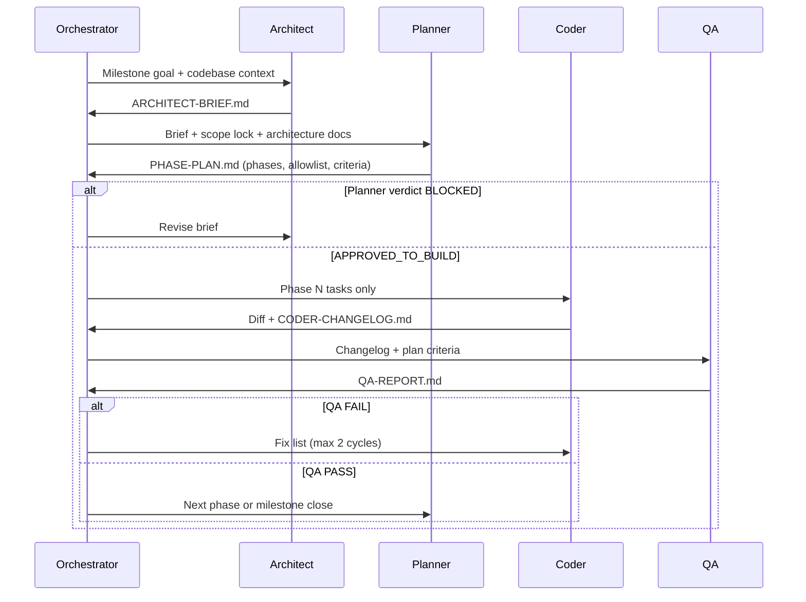

# Nexus Agent Orchestra — Orchestrator Playbook

**You are the conductor.** The parent Cursor agent runs this loop. Subagents are specialists; artifacts are the communication bus.

## The four roles

| Role | Subagent type | Mode | Output artifact |
|------|---------------|------|-----------------|
| **Architect** | `code-architect` | readonly | `ARCHITECT-BRIEF.md` |
| **Planner** | `code-architect` or `generalPurpose` | readonly | `PHASE-PLAN.md` |
| **Coder** | `generalPurpose` | write | code + `CODER-CHANGELOG.md` |
| **QA** | `shell` + readonly review | readonly runs | `QA-REPORT.md` |

Legacy **Overseer** maps to **Planner** (scope + allowlist). Keep `OVERSEER.md` as an alias for wave-based V1 work.

## Symbiotic loop (one phase)



## Directory layout

```
.planning/
├── agents/           # Role cards (this folder)
├── templates/        # Empty forms
├── milestones/
│   └── {milestone-id}/
│       ├── ARCHITECT-BRIEF.md
│       ├── PHASE-PLAN.md
│       ├── phases/
│       │   └── phase-{N}/
│       │       ├── CODER-CHANGELOG.md
│       │       └── QA-REPORT.md
│       └── STATUS.md   # Living state machine
└── waves/            # V1 wave artifacts (historical)
```

## Orchestrator rules

1. **Never skip Planner approval** — Coder does not start without `APPROVED_TO_BUILD` on the active phase.
2. **Pass artifacts, not memory** — Each subagent prompt must link file paths to read; assume no shared chat history.
3. **One phase at a time** — Planner may define 5 phases; Coder executes one phase per invocation unless tasks are explicitly parallel-safe.
4. **QA runs commands** — `npm run lint`, `typecheck`, `test`, `test:scope-check`, `build`, plus phase-specific checks.
5. **Architect is ambitious; Planner is ruthless** — Architect proposes; Planner cuts scope to shippable slices and maps to acceptance criteria.
6. **Scope lock wins** — [mvp-feature-scope-lock.md](../../docs/product-governance/mvp-feature-scope-lock.md) overrides Architect enthusiasm for banned features.

## Invocation templates

### Architect

```
Task subagent_type=code-architect readonly=true
Read: product-principles, scope lock, technical-architecture, relevant subsystem docs
Survey: src/, supabase/, tests/
Write: .planning/milestones/{id}/ARCHITECT-BRIEF.md
Verdict: READY_FOR_PLANNING | NEEDS_PRODUCT_INPUT
```

### Planner

```
Task subagent_type=code-architect readonly=true
Read: ARCHITECT-BRIEF.md, scope lock, coding-agent-rules, HANDOFF-PROTOCOL.md
Write: .planning/milestones/{id}/PHASE-PLAN.md
Verdict: APPROVED_TO_BUILD | CHANGES_REQUIRED | BLOCKED
```

### Coder

```
Task subagent_type=generalPurpose
Read: PHASE-PLAN.md phase-{N} section only, file allowlist, coding-agent-rules
Write: code + .planning/milestones/{id}/phases/phase-{N}/CODER-CHANGELOG.md
Do not touch files outside allowlist.
```

### QA

```
Task subagent_type=shell (tests) + readonly review
Read: PHASE-PLAN.md criteria for phase-{N}, CODER-CHANGELOG.md
Run: lint, typecheck, test, scope-check, build (+ e2e if phase requires)
Write: .planning/milestones/{id}/phases/phase-{N}/QA-REPORT.md
Verdict: PASS | FAIL
```

## Status machine (`STATUS.md`)

| State | Owner | Next action |
|-------|-------|-------------|
| `DRAFT` | Orchestrator | Spawn Architect |
| `ARCHITECTURE_READY` | Architect | Spawn Planner |
| `PLAN_APPROVED` | Planner | Spawn Coder phase 1 |
| `IMPLEMENTING` | Coder | — |
| `QA_REVIEW` | QA | PASS → next phase; FAIL → Coder |
| `MILESTONE_COMPLETE` | QA | Update FEASIBILITY-UAT / ship |

## CI gates (all phases)

```bash
npm run lint
npm run typecheck
npm test
npm run test:scope-check
npm run build
```
