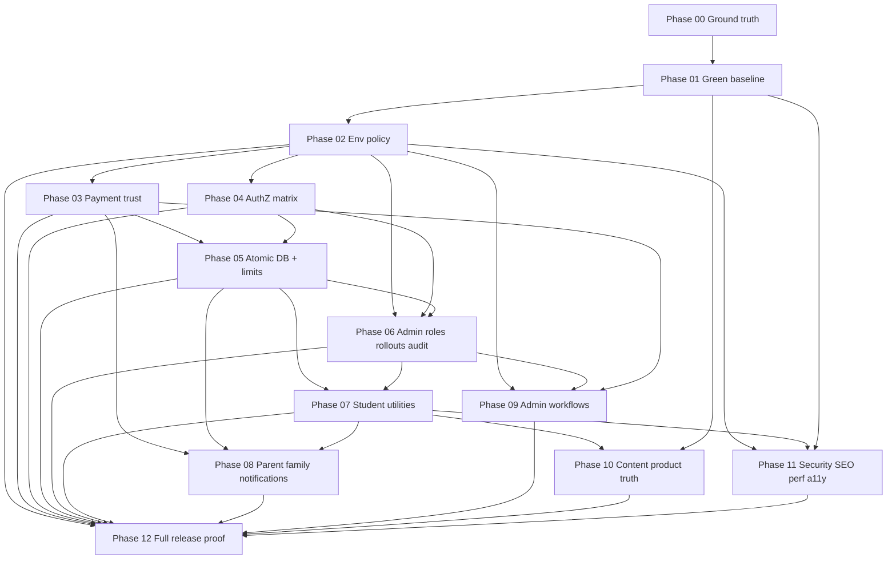

# ARCHITECT-BRIEF — Production Readiness (Phase 00)

## Executive summary

Nexus has a credible learning core (69 pages, 73 API routes, 39 migrations, 452 passing unit tests on `feat/kcse-math-f4-b2`) but is **not production-ready for paid or externally messaged launch**. Blockers cluster into five architectural fault lines:

1. **Money trust** — M-Pesa callback accepts unauthenticated forged success; missing Daraja config auto-activates paid subscriptions via `isMock`.
2. **Provider truth** — AI (text/camera/voice), Celcom SMS, and Resend email silently succeed with mock output when keys are absent; no boot-time `APP_ENV` fail-closed policy exists.
3. **Authorization drift** — Runtime reads `app_metadata.userRole`; admin role assignments write only `admin_role_assignments`; rollouts and entitlement debug are non-enforcing ledgers; `/admin/usage-stats` SSR bypasses super-admin guard.
4. **Concurrency gaps** — Daily Nex/practice quotas, family seats, invite consumption, and callback idempotency use read-then-write patterns without Postgres atomicity.
5. **Product truth vs shell** — Multiple student utilities, admin control surfaces, content `PROD_READY` labels, and governance docs overstate capability relative to implementation.

Remediation is structured as Phases 01–12 (dependency-ordered). Phase 00 establishes ground truth only; no product code changes. **Verdict: `READY_FOR_PLANNING`.**

---

## Patterns and conventions found

| Pattern | Location | Notes |
|---------|----------|-------|
| App Router + Route Handlers | `src/app/**/route.ts`, `src/app/api/**` | 73 API route files; handlers authenticate independently |
| Proxy (Next 16) | `src/proxy.ts` | Session refresh + coarse route-family gates; reads `app_metadata.userRole` |
| Page guards | `src/server/services/superAdminGuard.ts`, `requireStudentExperience()` on newer student pages | Must duplicate API authorization; SSR can bypass API-only guards |
| Service-role after guard | `createAdminClient()` in `src/lib/supabase/admin.ts` | Used pervasively in services; missing guard = data boundary failure |
| Nex pipeline | `src/lib/nex/generateNexResponse.ts` | Sole teaching orchestrator; routes call it after auth/limits |
| Platform pricing | `getEffectiveSubscriptionConfig()` in `src/lib/platform/getPlatformSettings.ts` | Required authority for limits/prices; 60s cache |
| Zod validation | `src/schemas/**` | Request/form contracts |
| Vitest | `tests/**`, `vitest` in `package.json` | 82 test files, 452 tests pass (2026-06-29) |
| Playwright | `e2e/**` (6 specs) | CI runs `npm run test:e2e` (build + playwright, not self-contained server lifecycle) |
| Migrations | `supabase/migrations/*.sql` | 39 files; never edit applied migrations |
| Admin audit | `recordAdminAudit()` in `src/server/services/adminAuditService.ts` | Fail-open (catch swallows errors; no `{ error }` check) |

**Repository counts (verified 2026-06-29, branch `feat/kcse-math-f4-b2`):** 69 pages, 73 API routes, 39 SQL migrations, 6 E2E specs. F4 B2 migration `20260625240000_kcse_math_f4_b2.sql` **exists** (map section 11 was stale).

**Baseline gate gaps:** `npm run typecheck` FAIL (ES2017 target vs dotAll regex in `tests/content/kcseMathSeedContent.test.ts`); `npm audit --audit-level=moderate` FAIL (undici high, postcss moderate); `npm run env:check` absent; `next.config.ts` empty (no security headers).

---

## P0/P1 journey traces

### 1. Payments — STK push → callback → subscription (P0)

```
/pricing (student) or /profile
  → UI checkout form
  → POST /api/mpesa/stk-push
      → createClient().auth.getUser()                    [session boundary]
      → student_profiles lookup (user-scoped client)
      → mpesaStkPushSchema (Zod)
      → createAdminClient()                              [service-role]
      → subscription_plans validate
      → getEffectiveSubscriptionConfig() + resolvePlanAmountKes()
      → INSERT mpesa_payments (pending → processing)
      → initiateStkPush() in src/lib/mpesa/mpesaClient.ts
          → if !MPESA_* env: returns isMock=true + checkoutRequestId
          → if configured: Daraja STK push
      → if isMock: UPDATE paid + activateSubscriptionFromPayment() + sendPaymentSuccessNotifications()
      → JSON { checkoutRequestId, isMock } to client     [P0: ID leaked to attacker]

Safaricom / attacker
  → POST /api/mpesa/callback                             [PUBLIC — no auth/signature]
      → parseMpesaCallbackPayload(body)
      → isCallbackAlreadyProcessed()                       [check-then-insert race]
      → findPaymentByCheckoutRequestId(checkoutRequestId)
      → logMpesaCallback()
      → if resultCode===0 && receipt: markPaymentPaidFromCallback()
      → activateSubscriptionFromPayment()
          → billingEventExists() idempotency (partial)
          → student_subscriptions UPSERT
          → family: createFamilyGroupForPayment() if plan_code=family
          → billing_events, payment_transactions, invoices
      → sendPaymentSuccessNotifications()
      → markCallbackProcessed()
```

**Tables:** `mpesa_payments`, `mpesa_callbacks`, `student_subscriptions`, `subscription_plans`, `billing_events`, `payment_transactions`, `invoices`, `family_groups`, `family_group_members`.

**P0 defects:** Unauthenticated callback trusts `checkoutRequestId` + `resultCode` + receipt text; mock path grants paid access without credentials; no Daraja STK Query reconciliation.

**Owner phases:** 02 (fail-closed env), 03 (payment trust), 05 (atomic callbacks/idempotency), 08 (notification truth).

---

### 2. Nex pipeline — must never bypass `generateNexResponse` (P0/P1)

```
/nex, /assignment-help
  → Nex UI (src/features/nex/**)
  → POST /api/nex/chat
      → createClient().auth.getUser()
      → student_profiles (full row)
      → nexChatRequestSchema
      → getNexDailyUsageCount() / limit from getEffectiveSubscriptionConfigWithFallback()
      → incrementNexDailyUsage()                         [P1: read-then-update race]
      → session/message persistence (service-role patterns in route)
      → generateNexResponse()                            [MANDATORY PIPELINE]
          → detectNexMode()
          → updateSocraticState() / buildSocraticOverlays()
          → loadStudentMemory() / loadCurriculumContext()
          → assemblePrompt()
          → callNexModel() or streamNexModel()
              → if !GEMINI && !OPENAI: mock provider      [P0.3]
          → validateNexResponseWithJudge() (homework/assessment paths)
          → presentation/metadata merge
      → persist messages, misconceptions, mastery side effects
      → SSE or JSON response

POST /api/nex/camera (homework + paid/family gate)
  → upload → extractImageText() [mock if NEX_MOCK_AI or no key]
  → generateNexResponse()

POST /api/nex/voice
  → voiceTranscribe() [mock fallback]
  → generateNexResponse()
  → voiceSynthesize() [mock fallback]
```

**Call sites of `generateNexResponse` (complete inventory):** `src/app/api/nex/chat/route.ts`, `camera/route.ts`, `voice/route.ts` only. Admin content assist uses separate AI paths (`/api/admin/content/assist`) — non-teaching, acceptable.

**Hard rule:** Any new teaching surface (assessment mode extensions, multimodal) must call `generateNexResponse`; never call `callNexModel` directly from routes.

**Owner phases:** 02 (provider fail-closed), 05 (atomic usage), 07 (utilities touching Nex), 11 (CSP for camera/mic), 12 (E2E multimodal).

---

### 3. Auth and roles — `app_metadata` vs `admin_role_assignments` (P1)

```
/signup
  → signupAction (src/server/actions/authActions.ts)
      → isBetaInviteRequired() + validateInviteCode()   [email only]
      → supabase.auth.signUp()
      → setUserRole() → Auth admin API app_metadata.userRole
      → createStudentProfile / createParentProfile
      → consumeInvite()                                  [non-transactional with signup]

/auth/callback (Google OAuth)
  → exchangeCodeForSession()
  → existingRole = app_metadata.userRole OR query param role
  → setUserRole() if new
  → profile bootstrap
  → NO beta invite check                               [P2 policy gap]

Runtime authorization readers of app_metadata.userRole:
  - src/proxy.ts:57
  - src/server/services/superAdminGuard.ts:8,44
  - src/server/services/authService.ts:16,51,98
  - src/app/auth/callback/route.ts:58
  - src/app/api/admin/platform-settings/route.ts:16,106
  - src/app/api/admin/beta-invites/route.ts:15,42,86

admin_role_assignments writers (NO Auth metadata update):
  - POST /api/admin/roles → assignAdminRole() in adminPlatformService.ts:305-323
  - INSERT/upsert admin_role_assignments only

admin_role_assignments readers:
  - GET /api/admin/roles → listAdminRoleAssignments()
  - Admin dashboard summaries (adminPlatformService, admin read services)

Proxy admin gate: role ∈ {super_admin, support} for /admin/**
Page-level super-admin-only: requireSuperAdmin() / requireAdminApi(..., ["super_admin"])
Support-blocked surfaces: Studio, settings, roles, comp, impersonate, rollouts (per map)
DEFECT: src/app/(super-admin)/admin/usage-stats/page.tsx calls loadNexOpsSnapshot() with NO guard
        API /api/admin/usage-stats is super-admin-only — SSR bypass
```

**Owner phases:** 04 (AuthZ matrix, OAuth beta, signup atomicity), 06 (canonical role model + rollouts).

---

### 4. Student utilities (P1.8)

| Utility | Page | API | Service | Tables | Maturity |
|---------|------|-----|---------|--------|----------|
| Study Search | `/study-search` | — | `studentExperienceService` (static route index) | weak areas, saved, recent lessons | Partial — no content index |
| Saved | `/saved` | `/api/students/saved-items` | `studentExperienceService` | `student_saved_items` | Partial — lesson/practice flows don't write |
| Mistakes | `/mistakes` | `/api/students/mistakes` | `studentExperienceService` | `student_mistake_journal` | Shell — practice/mock don't insert |
| Weekly Goal | `/weekly-goal` | `/api/students/weekly-goal` | `studentExperienceService` | `student_weekly_goals` | Partial — parent doesn't read |
| Focus | `/focus` | `/api/students/focus-sessions` | `studentExperienceService` | `student_focus_sessions` | Shell — manual complete, no timer |
| Offline | `/offline` | `/api/students/offline-packs` | `studentExperienceService` | `student_offline_packs` | Shell — metadata only |
| Concept Library | `/library` | — | static cards → `/learn` | — | Shell |
| Learning Memory | `/nex-memory` | — | profile/progress projection | mastery, progress | Partial |
| Readiness | `/readiness` | mock/exam APIs | progress/mock services | mock results | Partial — static CTAs |

**Proxy gap:** Routes like `/tasks`, `/continue`, `/saved`, `/mistakes`, `/focus`, `/offline`, `/library`, `/study-search`, `/weekly-goal`, `/nex-memory`, `/readiness`, `/weak-areas` are NOT in `proxy.ts` matcher — they rely on page-level `requireStudentExperience()`.

**Owner phase:** 07 (implementation), 08 (weekly goal parent visibility), 10 (coverage labels).

---

### 5. Admin control plane (P1.6, P1.7, P1.10)

```
/admin (support + super_admin via proxy)
  → Page components in src/app/(admin)/** and src/app/(super-admin)/**
  → Mixed patterns:
      Operational reads: adminOpsService, adminPlatformService, nexOpsService
      Ledger-only (no runtime effect):
        - /admin/roles → admin_role_assignments (no Auth sync)
        - /admin/rollouts → admin_feature_rollouts (no feature gate consumer)
        - /admin/experiments, /admin/approvals, /admin/bulk-actions
        - /admin/communications (templates/logs, no sender)
        - /admin/reports (no CSV export)
      Entitlement debug: adminPlatformService.ts:807 featureEnabled: true hardcoded

Privileged mutations → recordAdminAudit() (fail-open)
  → admin_audit_log via service-role
  → catch swallows all failures; no { error } check on insert

/admin/health — derived DB summaries; hardcodes healthy; no provider probes
```

**Owner phases:** 02 (health probe primitives), 06 (roles, rollouts, audit durability), 09 (executable workflows), 04 (usage-stats guard).

---

### 6. Notifications (P0.3, P2)

```
Triggers:
  - sendParentLinkSuccessNotification() ← /api/parents/link
  - sendPaymentSuccessNotifications() / sendPaymentFailedNotification() ← payment paths
  - weeklyReportService ← GET/POST /api/cron/weekly-reports (Bearer CRON_SECRET)
  - adminParentNotifyService ← /api/admin/outcomes/parent-sms (super_admin)

notificationService.ts
  → loadSmsTemplate() / loadEmailTemplate() from DB
  → sendCelcomSms() in celcomClient.ts
      → shouldUseMock(): !CELCOM_* || NOTIFICATIONS_MOCK=true
      → INSERT celcom_sms_logs (may show delivered while mock)
  → sendResendEmail() in resendClient.ts (same mock pattern)

POST /api/celcom/webhook — public, unverified delivery updates
```

**Owner phases:** 02 (notification fail-closed), 03 (webhook trust if exposed), 08 (retry, preferences, retention), 09 (campaign sender if promised).

---

## Trust boundaries table

| Boundary | Entry | AuthN | AuthZ | Data access | Known failure |
|----------|-------|-------|-------|-------------|---------------|
| **Proxy** | `src/proxy.ts` | Supabase session cookie | `app_metadata.userRole` + student profile flags | User-scoped client for profile probe | Newer student routes omitted from matcher; relies on page guards |
| **Page guards** | Server Components / layouts | `createClient().getUser()` | `requireSuperAdmin`, `requireAdminRole`, `requireStudentExperience` | Often service-role in child data loaders | `/admin/usage-stats` missing guard (P1.2) |
| **API handlers** | `src/app/api/**` | Per-route session or secret | Role checks, ownership checks | User client or service-role post-check | Inconsistent; each handler independent |
| **Server Actions** | `src/server/actions/**` | Session in action | Inline checks | User-scoped + admin for role set | Signup/invite not transactional |
| **Service-role** | `createAdminClient()` | N/A (bypasses RLS) | **Caller must prove authorization** | All tables | Guard omission = full data exposure |
| **RLS** | Postgres policies | JWT via user client | Table policies | Student own-row; parent linked-read | Service-role bypasses; tests often string-inspect migrations |
| **Webhooks** | `/api/mpesa/callback`, `/api/celcom/webhook` | **None** | **None** | Service-role payment/SMS updates | Forged M-Pesa success (P0.1) |
| **Cron** | `/api/cron/weekly-reports` | `Authorization: Bearer CRON_SECRET` | Secret only | Service-role batch reads/writes | Secret rotation, error leakage |
| **Public forms** | `/api/waitlist/teacher` | None | Rate limit (in-memory Map) | Service-role insert | P1.11 process-local limiter |

---

## Migration ordering constraints (39 migrations)

**Rule:** Never edit applied migrations. New remediation migrations append with `npx supabase migration new`. Test with `npm run db:reset` before linked operations.

### Chronological layers

| Order | Migration file | Domain | Depends on |
|------:|----------------|--------|------------|
| 1 | `20250613120000_create_core_schema.sql` | Auth profiles, curriculum hierarchy, students/parents | — |
| 2 | `20250613120100_create_learning_tables.sql` | Diagnostic, practice, Nex, study plans | core |
| 3 | `20250613120200_create_billing_notifications.sql` | Plans, payments, templates, logs | core |
| 4 | `20250613120300_enable_rls.sql` | RLS enable + baseline policies | all prior tables |
| 5 | `20250613130000_create_family_groups.sql` | Family groups/members | billing, students |
| 6 | `20250613140000_create_beta_invites.sql` | Beta invites | core |
| 7–16 | `20250614*`–`20250616*` | Topic sort, waitlist, content pipeline, lesson progress, prefs, RLS hardening | core + learning |
| 17–22 | `20250615*`–`20250622*` | Mock exams, science/english subjects, KCSE metadata/calibration | learning |
| 23–28 | `20250623*` | Admin audit, impersonation, flags/coupons, media storage, review workflow | admin + content |
| 29 | `20260622090000_add_kiswahili_chemistry_subjects.sql` | Subject seeds | curriculum |
| 30 | `20260624100000_admin_ops_support_rollouts.sql` | Support cases, rollouts, alerts, roles | admin |
| 31 | `20260624110000_admin_platform_operations.sql` | Platform settings audit, communications, experiments | admin |
| 32 | `20260625060211_student_experience_tools.sql` | Saved, mistakes, weekly goals, focus, offline | students |
| 33–39 | `20260625120000` → `20260625240000_kcse_math_f4_b2.sql` | KCSE math content seeds (F1–F4 batches) | curriculum + lessons/questions |

### Remediation migration ordering (planned, not yet created)

1. **Phase 03** — Payment idempotency: unique indexes on `mpesa_receipt_number`, callback event keys; payment state machine constraints; webhook capability tokens (if designed).
2. **Phase 05** — Atomic functions: `increment_nex_daily_usage`, `increment_practice_daily_usage`, `consume_beta_invite`, `join_family_group`, `activate_subscription_from_payment` (transactional).
3. **Phase 05** — Rate limit table + cleanup function.
4. **Phase 06** — Rollout evaluation table/functions if persisted cache needed.
5. **Phase 08** — Notification outbox, delivery state columns, retention job markers.

**F4 B2 note:** `20260625240000_kcse_math_f4_b2.sql` exists on current branch; content tests reference it. Phase 01 must fix typecheck without rewriting applied content migrations.

**Compatibility:** Privileged `SECURITY DEFINER` functions must live in restricted schema, `search_path` pinned, caller role validated inside function body (per master prompt Supabase rules).

---

## Concurrency invariants requiring atomic Postgres

| Invariant | Current pattern | Location | Required fix |
|-----------|-----------------|----------|--------------|
| Nex daily quota | SELECT count → UPDATE/INSERT | `nexUsageService.ts:32-74` | `INSERT ... ON CONFLICT DO UPDATE` or RPC with row lock |
| Practice daily quota | Same | `nexUsageService.ts:114-156` | Same |
| Family seat cap | READ seat_count → INSERT member → UPDATE count | `familySubscriptionService.ts:73-107` | Serializable transaction or `SELECT FOR UPDATE` on `family_groups` |
| Beta invite single-use | validate → signup → consumeInvite separate | `authActions.ts`, `betaInviteService.ts` | Atomic consume with `used_at` conditional update |
| M-Pesa callback idempotency | isCallbackAlreadyProcessed → log → process | `callback/route.ts`, `subscriptionService.ts:370-386` | Unique constraint on `(checkout_request_id, result_code)` + transactional processing |
| Subscription activation | billingEventExists check then writes | `subscriptionService.ts:203+` | Idempotent activation RPC; unique billing event keys |
| Trial once-only | SELECT existing → INSERT | `subscriptionService.ts:87-120` | Unique on `student_id` in `subscription_trials` + handle conflict |
| Free subscription bootstrap | SELECT existing → INSERT | `ensureFreeSubscription()` | `ON CONFLICT DO NOTHING` |
| Teacher waitlist rate limit | In-memory Map | waitlist route | Durable limiter table (Phase 05) |
| Payment receipt uniqueness | None enforced | `mpesa_payments` | UNIQUE on `mpesa_receipt_number` where not null |

---

## Environment and provider architecture (Phase 02)

### Proposed model

```
APP_ENV: test | development | staging | production   (explicit; never infer from NODE_ENV alone)
APP_ORIGIN: canonical HTTPS origin (required prod/staging)

Provider modes (per integration):
  NEX_PROVIDER_MODE: mock | live
  MPESA_PROVIDER_MODE: mock | sandbox | live
  NOTIFICATIONS_PROVIDER_MODE: mock | live

Production rules (fail-closed):
  - APP_ENV=production → all *_MODE must be live; all credential sets complete
  - Missing GEMINI/OPENAI → Nex returns 503 CONFIGURATION_ERROR, never mock
  - Missing MPESA_* → STK push rejected; never isMock paid activation
  - Missing CELCOM/RESEND → notification queued as failed/deferred, never mock-delivered
  - instrumentation.ts / env:check runs before accepting traffic

Test/CI rules:
  - APP_ENV=test, NEX_PROVIDER_MODE=mock, NOTIFICATIONS_PROVIDER_MODE=mock (explicit)
  - CI already sets NEX_MOCK_AI=true — replace with typed policy module

Staging rules:
  - Real AI + notifications; M-Pesa sandbox or live with authorization
  - Daraja sandbox credentials; no mock success records
```

### Current silent mock paths (must eliminate in production)

| Provider | File | Trigger |
|----------|------|---------|
| Gemini/OpenAI text | `src/lib/nex/callNexModel.ts:156-160` | No API keys |
| Vision/OCR | `src/lib/nex/extractImageText.ts:64-67` | No key or `NEX_MOCK_AI=true` |
| Voice STT/TTS | `voiceTranscribe.ts`, `voiceSynthesize.ts` | No keys / mock fallback |
| M-Pesa | `src/lib/mpesa/mpesaClient.ts:71-77` | `!isMpesaConfigured()` |
| STK route | `stk-push/route.ts:156-182` | `stkResult.isMock` auto-paid |
| Celcom | `src/lib/celcom/celcomClient.ts:29-33` | Not configured or `NOTIFICATIONS_MOCK` |
| Resend | `src/lib/resend/resendClient.ts` | Same pattern |

### Phase 02 deliverables (architecture)

- `src/lib/env/` — Zod schema, `assertProductionEnvironment()`, `getProviderMode()`
- `scripts/env-check.ts` → `npm run env:check`
- Server `instrumentation.ts` hook calling env validation
- Refactor clients to accept injected mode; production refuses mock adapters
- `/admin/health` consumes probe interface from env module (presentation in Phase 09)

---

## Role and rollout canonical model (Phase 06 recommendation)

### Decision: single runtime claim in Auth metadata

**Canonical authorization claim:** `user.app_metadata.userRole` ∈ `student | parent | support | super_admin`

| Source | Role today | Phase 06 target |
|--------|------------|-----------------|
| `app_metadata.userRole` | **Runtime authority** | Remains canonical |
| `admin_role_assignments.role_key` | Ledger only | Write-through to Auth on assign/revoke |
| `student_profiles` / `parent_profiles` | No role field | Unchanged |
| `super_admin_profiles` | Profile extension | Optional metadata; not authority |
| JWT custom claims | Not used | Do not add parallel claim without migration plan |

### Readers inventory (`app_metadata.userRole`)

- `src/proxy.ts`
- `src/server/services/superAdminGuard.ts`
- `src/server/services/authService.ts`
- `src/app/auth/callback/route.ts`
- `src/app/api/admin/platform-settings/route.ts`
- `src/app/api/admin/beta-invites/route.ts`

### Writers inventory

- `setUserRole()` in `authService.ts` — signup, OAuth bootstrap
- Supabase Auth admin (manual/dashboard) — out of band
- **Missing:** `assignAdminRole()` does NOT call `setUserRole()`

### Centralization architecture

```
src/server/auth/permissions.ts (new)
  → evaluateRole(user): Role
  → requirePermission(user, Permission): AuthResult
  → isFeatureEnabled(user, featureKey, context): boolean   // rollout + entitlement

Consumers (migrate incrementally):
  - proxy.ts (thin: session + redirect only; or call permissions)
  - superAdminGuard.ts → wraps permissions
  - requireAdminApi.ts
  - All /api/admin/* routes
  - Navigation builders (student shell, admin shell)
  - Entitlement debug in adminPlatformService (remove hardcoded true)
```

### Rollout architecture

- `admin_feature_rollouts` becomes source for `isFeatureEnabled()`
- Typed feature registry with **default false** for unreleased utilities
- Server enforcement at route handler + page guard + navigation
- **Precedence:** requires DECISION-REGISTER entry before Phase 06 build (see below)

### Drift detection

- Cron or health job: compare `admin_role_assignments` to `app_metadata.userRole` → critical alert if mismatch

---

## Next.js 16.2.9 guide path index

Installed version: `next@16.2.9` (from `package.json`). Use App Router (`01-app`) guides as primary.

| Topic | Absolute path |
|-------|---------------|
| Route handlers | `C:\Users\gar\Desktop\Garnet Labs\nexus\node_modules\next\dist\docs\01-app\01-getting-started\15-route-handlers.md` |
| Proxy | `C:\Users\gar\Desktop\Garnet Labs\nexus\node_modules\next\dist\docs\01-app\01-getting-started\16-proxy.md` |
| Proxy (file convention reference) | `C:\Users\gar\Desktop\Garnet Labs\nexus\node_modules\next\dist\docs\01-app\03-api-reference\03-file-conventions\proxy.md` |
| Authentication | `C:\Users\gar\Desktop\Garnet Labs\nexus\node_modules\next\dist\docs\01-app\02-guides\authentication.md` |
| Data security | `C:\Users\gar\Desktop\Garnet Labs\nexus\node_modules\next\dist\docs\01-app\02-guides\data-security.md` |
| Content Security Policy (CSP) | `C:\Users\gar\Desktop\Garnet Labs\nexus\node_modules\next\dist\docs\01-app\02-guides\content-security-policy.md` |
| Environment variables | `C:\Users\gar\Desktop\Garnet Labs\nexus\node_modules\next\dist\docs\01-app\02-guides\environment-variables.md` |
| Headers (`headers()` function) | `C:\Users\gar\Desktop\Garnet Labs\nexus\node_modules\next\dist\docs\01-app\03-api-reference\04-functions\headers.md` |
| Headers (`next.config.js`) | `C:\Users\gar\Desktop\Garnet Labs\nexus\node_modules\next\dist\docs\01-app\03-api-reference\05-config\01-next-config-js\headers.md` |
| Metadata and OG images (guide) | `C:\Users\gar\Desktop\Garnet Labs\nexus\node_modules\next\dist\docs\01-app\01-getting-started\14-metadata-and-og-images.md` |
| `generateMetadata` | `C:\Users\gar\Desktop\Garnet Labs\nexus\node_modules\next\dist\docs\01-app\03-api-reference\04-functions\generate-metadata.md` |
| `opengraph-image` convention | `C:\Users\gar\Desktop\Garnet Labs\nexus\node_modules\next\dist\docs\01-app\03-api-reference\03-file-conventions\01-metadata\opengraph-image.md` |
| Production checklist | `C:\Users\gar\Desktop\Garnet Labs\nexus\node_modules\next\dist\docs\01-app\02-guides\production-checklist.md` |
| Playwright testing | `C:\Users\gar\Desktop\Garnet Labs\nexus\node_modules\next\dist\docs\01-app\02-guides\testing\playwright.md` |
| Vitest testing | `C:\Users\gar\Desktop\Garnet Labs\nexus\node_modules\next\dist\docs\01-app\02-guides\testing\vitest.md` |
| Instrumentation (guide) | `C:\Users\gar\Desktop\Garnet Labs\nexus\node_modules\next\dist\docs\01-app\02-guides\instrumentation.md` |
| `instrumentation.ts` convention | `C:\Users\gar\Desktop\Garnet Labs\nexus\node_modules\next\dist\docs\01-app\03-api-reference\03-file-conventions\instrumentation.md` |
| `instrumentation-client.ts` convention | `C:\Users\gar\Desktop\Garnet Labs\nexus\node_modules\next\dist\docs\01-app\03-api-reference\03-file-conventions\instrumentation-client.md` |

**Implementation notes from guides (for Planner/Coder):**
- Proxy replaces middleware; matcher in `src/proxy.ts` export `config`.
- CSP likely needs nonce strategy per CSP guide; camera/mic require Permissions-Policy coordination (Phase 11).
- `instrumentation.ts` is the correct server boot hook for env validation (not legacy `sentry.server.config.ts` alone).
- Route Handlers are edge/server explicit; webhook/cron paths stay Route Handlers, not Server Actions.

---

## Phase dependency graph (00–12)



| Phase | Title | Key ledger IDs | Hard dependencies |
|-------|-------|----------------|-------------------|
| 00 | Ground truth, ledger | ALL discovery | — |
| 01 | Green baseline | P1.1, P1.4, Tier-2.5 verify | 00 QA PASS |
| 02 | Production environment policy | P0.3, P1.10 (probes) | 01 |
| 03 | Payment trust | P0.1, P0.2 | 02 |
| 04 | AuthZ and account consistency | P1.2, signup/OAuth | 02 |
| 05 | Atomic DB + rate limiting | P1.3, P1.11 | 03, 04 |
| 06 | Admin authZ, rollouts, audit | P1.6, P1.7 | 02, 04, 05 |
| 07 | Student utilities | P1.8 | 05, 06 (rollout gates for shells) |
| 08 | Parent, family, notifications | parent/privacy rows | 03, 05, 07 (weekly goal split) |
| 09 | Admin operational workflows | admin shells | 02, 06, 03 |
| 10 | Content coverage and product truth | P1.9, P1.12 | 01, 07 (concept library consumer) |
| 11 | Browser security, a11y, perf | P1.5, observability | 02, 07, 01 |
| 12 | Full-system release proof | E2E, staging signoff | ALL prior |

**Parallelism:** Phases 03 and 04 can run sequentially after 02 (03 before 05; 04 before 05). Phase 07 should not start before 06 defines feature registry defaults.

---

## Architecture decision proposals (DECISION-REGISTER seeds)

### DEC-PR-001 — Rollout precedence order

**Question:** When rollout, experiment, plan entitlement, and role permissions disagree, which wins?

**Evidence:** `admin_feature_rollouts` stored but unused; `adminPlatformService.ts:807` hardcodes `featureEnabled: true`; experiments ledger has no exposure consumer.

**Options:**

| Order | Stack (highest first) | Tradeoff |
|-------|----------------------|----------|
| A | Emergency off → role → plan entitlement → rollout → experiment | Safest; experiment never overrides safety |
| B | Emergency off → rollout → plan → role → experiment | Product marketing can gate features by cohort |
| C | Plan → rollout → role | Risks paid user blocked by rollout |

**Proposal:** **Option A** — emergency kill switch > role permission > subscription entitlement > rollout cohort > experiment variant. Experiments may only narrow exposure within an already-enabled rollout.

**Authority needed:** Explicit product decision before Phase 06 `APPROVED_TO_BUILD`.

**Affected ledger:** P1.6, experiment rows, Phase 09 experiments.

---

### DEC-PR-002 — Content `PROD_READY` definition

**Question:** What threshold should `getTopicReadinessLabel()` use for `PROD_READY`?

**Evidence:** `MIN_PRACTICE_QUESTIONS_PER_TOPIC = 21` in `contentModel.ts:38` but `isTopicPracticeReady()` only requires 5 in one difficulty band (`MIN_QUESTIONS_TO_START_PRACTICE`). Studio labels can show `PROD_READY` at 5+5+5=15 or even 5 total.

**Proposal:** Split labels:

- `SESSION_STARTABLE` — current `isTopicPracticeReady()` (≥5 in one band)
- `PROD_READY` — `learnReady` AND ≥7 easy AND ≥7 medium AND ≥7 hard (21 total) per `MIN_PRACTICE_QUESTIONS_PER_TOPIC` intent
- Publish/rollout gate uses `PROD_READY` only

**Authority:** Code-derived preferred; product confirms label naming in Studio UI.

**Affected ledger:** P1.9, Phase 10.

---

### DEC-PR-003 — Beta invite policy for Google OAuth

**Question:** Must OAuth signups consume a beta invite when `BETA_INVITE_REQUIRED=true`?

**Evidence:** `signupAction` enforces invite; `/auth/callback` does not call `validateInviteCode` or `consumeInvite`.

**Options:**

| Option | Behavior |
|--------|----------|
| A | Block OAuth signup without prior invite validation (redirect to invite gate) |
| B | Allow OAuth during beta (invite email-only) |
| C | Require invite code as OAuth query param persisted through state |

**Proposal:** **Option A or C** for policy consistency — OAuth must not be a bypass. Implementation favor **C** (state param) for UX.

**Authority needed:** Product/legal decision before Phase 04 OAuth work.

**Affected ledger:** signup/OAuth transactional rows, Phase 04.

---

### DEC-PR-004 — M-Pesa callback trust model (technical, cite provider)

**Question:** How to verify payment without inventing signatures?

**Evidence:** Daraja callbacks are custom JSON; checkout ID returned to client; no HMAC in current integration.

**Proposal:** Per Safaricom Daraja docs (Phase 03 research task): STK Query as independent proof; opaque per-payment callback token; never trust checkout ID alone; unique receipt constraint; reconciliation job.

**Authority:** Provider contract + security constraint.

**Affected ledger:** P0.1, P0.2, Phase 03.

---

## Risks and mitigations

| Risk | Severity | Mitigation |
|------|----------|------------|
| Forged payment activation | Critical | Phase 03 STK Query + idempotency + remove mock paid path |
| Mock providers in production | Critical | Phase 02 fail-closed env policy |
| Support sees Nex flagged content via SSR | High | Phase 04 guard on usage-stats page |
| Quota/seat races | High | Phase 05 Postgres RPCs |
| Role assignment theater | High | Phase 06 Auth metadata sync |
| Shell features erode trust | Medium | Phase 07 complete or rollout-gate defaults off |
| CI green via build-only | Medium | Phase 01 enforce typecheck in CI |
| Governance doc drift | Medium | Phase 10 doc reconciliation |

---

## Recommended sequencing (for Planner)

See Phase dependency graph. Planner must produce:

1. `REMEDIATION-LEDGER.md` — one row per map gap + master prompt catalog item (no collapsing)
2. `PHASE-PLAN.md` — per-phase exact file allowlists (no `src/**` globs)
3. `DECISION-REGISTER.md` — seed DEC-PR-001 through DEC-PR-004; escalate 001 and 003 to user before Phase 06/04 respectively

**Phase 01 first code touch:** Fix `kcseMathSeedContent.test.ts` dotAll without unsafe target bump (regex refactor or test-only tsconfig per decision). Reconcile F4 B2 test with existing migration.

---

## Verdict

**`READY_FOR_PLANNING`**

Architectural ground truth is established. No unresolved architectural ambiguity blocks planning except three product-authority decisions (DEC-PR-001 rollout precedence, DEC-PR-003 beta OAuth policy, and confirm DEC-PR-002 label naming). Planner may decompose Phases 01–12 with ledger rows and file allowlists. QA should verify Phase 00 independently (no product code changes).

---

## Open questions for product (non-blocking for planning start)

1. Rollout precedence: confirm Option A or choose alternative (DEC-PR-001).
2. Beta OAuth: require invite on OAuth or explicit email-only exception (DEC-PR-003).
3. Shell features: complete vs hide — program default is complete; confirm no scope removals.
4. Mock exam wording: generated practice vs licensed past papers (Phase 10; default = accurate wording only).
