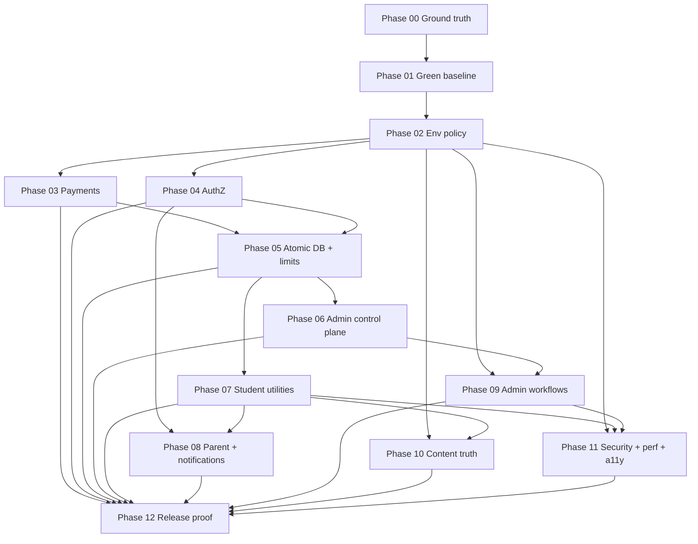

# PHASE-PLAN — Production Readiness (Phases 00–12)

**Ledger:** [REMEDIATION-LEDGER.md](./REMEDIATION-LEDGER.md)  
**Decisions:** [DECISION-REGISTER.md](./DECISION-REGISTER.md)  
**Overall program verdict:** `NOT_READY` (baseline)  
**Single active build phase:** Phase 00 only (`APPROVED_TO_BUILD`, planning-only)

## Milestone exit criteria

- [ ] All 139 ledger rows terminal `VERIFIED_COMPLETE` (or evidenced `VERIFIED_NOT_REPRODUCIBLE` / `SUPERSEDED_WITH_EVIDENCE`)
- [ ] `FINAL-SIGNOFF.md` QA-signed `READY_FOR_PRODUCTION`
- [ ] Fresh rescan matches updated `nexus-map.md`
- [ ] Full verification matrix green from clean `npm ci`

## Dependency graph



**Critical path:** 00 → 01 → 02 → 03 → 05 → 06 → 07 → 08 → 09 → 10 → 11 → 12  
**Parallel after Phase 02:** Phase 04 may start after 02 (auth/env) while 03 proceeds; Phase 10 can overlap late 07 only for doc/coverage reads, not utility implementation.

---

## Phase 00 — Ground truth, ledger, and authority reset

**Status:** `APPROVED_TO_BUILD` (planning only — **no product code changes**)  
**Depends on:** none

### Goal

Establish lossless program baseline, full ledger, all-phase plan, and decision register before any product edits.

### Criterion IDs (ledger)

| ID | Ledger rows |
|----|-------------|
| PR-00-GT-01 | PR-121, PR-122 (map count reconciliation) |
| PR-00-GT-02 | All 139 rows owned, zero duplicates |
| PR-00-GT-03 | Next.js 16.2.9 guide paths recorded |
| PR-00-GT-04 | Baseline gate commands re-run with exit codes |

### Tasks

1. Capture worktree evidence in `STATUS.md` (branch, status, diff, log).
2. Re-enumerate routes/APIs/migrations/tests; record fresh counts vs map.
3. Re-run safe baseline commands; do not reuse map-only evidence.
4. Populate `REMEDIATION-LEDGER.md` (139 rows) and `DECISION-REGISTER.md`.
5. Publish this `PHASE-PLAN.md` with phases 01–12 dependency-ready specs.
6. Record installed Next.js guide paths under `node_modules/next/dist/docs/` (route handlers, Proxy, auth, CSP, env, headers, metadata, production checklist, Playwright, Vitest).
7. Record migration history through `20260625240000_kcse_math_f4_b2.sql`.
8. Mark Tier 1 Phase 2.5 voice verification as **unverified** pending Phase 01.

### File allowlist

```
.planning/milestones/production-readiness/STATUS.md
.planning/milestones/production-readiness/PHASE-PLAN.md
.planning/milestones/production-readiness/REMEDIATION-LEDGER.md
.planning/milestones/production-readiness/DECISION-REGISTER.md
.planning/milestones/production-readiness/phases/phase-00/CODER-CHANGELOG.md
.planning/milestones/production-readiness/phases/phase-00/QA-REPORT.md
nexus-map.md
```

### Out of scope

- Any file under `src/`, `tests/`, `supabase/`, `e2e/`, `package.json`, CI workflows
- `ARCHITECT-BRIEF.md` (Architect agent; not blocking Phase 00 QA of planning artifacts)

### Verification commands

```powershell
git branch --show-current
git status --short
npm run orchestrator:status
npm run lint
npm run typecheck
npm test
npm run test:scope-check
npm run build
npm audit --audit-level=moderate
Get-ChildItem supabase/migrations/*.sql | Measure-Object
Get-ChildItem e2e/*.spec.ts | Measure-Object
```

### RED / baseline evidence

- Record **RED** `npm run typecheck` (TS1501 dotAll) — expected until Phase 01.
- Record **RED** `npm audit --audit-level=moderate` — expected until Phase 01.
- Ledger reconciliation: 139 rows, 0 duplicates, 0 missing owners.

### Acceptance criteria

- [ ] Every map §5–§12 gap has exactly one ledger row with owner phase 00–12.
- [ ] Phase 01–12 sections exist with explicit allowlists (no `src/**` globs).
- [ ] No product code diff in phase 00 Coder changelog.
- [ ] QA independently verifies ledger totals and baseline command output.

### Planner verdict

`APPROVED_TO_BUILD` — planning-only; Coder may write milestone artifacts and optional `nexus-map.md` count fixes only.

---

## Phase 01 — Green baseline and deterministic release harness

**Status:** `APPROVED_TO_BUILD`  
**Depends on:** Phase 00 QA PASS ✓

### Goal

Make ordinary quality gates reliable and complete Tier 1 Phase 2.5 deferred verification before security/product remediation layers.

### Criterion IDs

PR-011, PR-012, PR-017, PR-018, PR-116, PR-117, PR-118, PR-119, PR-120

### Tasks

1. Fix standalone typecheck (DEC-012: prefer regex rewrite or test tsconfig over blind target bump).
2. Reconcile `kcseMathSeedContent.test.ts` with existing F4 B2 migration (DEC-015).
3. Execute Tier 1 Phase 2.5 voice batch verification; fix regressions.
4. Resolve dependency advisories (DEC-004) without Next downgrade.
5. Expand `deploy:check` to lint, typecheck, test, scope-check, build, audit.
6. Add `env:check` stub (strict validation completed in Phase 02).
7. Rewrite `test:e2e:ci` to build, start production server, readiness probe, Playwright, teardown.
8. Update `.github/workflows/ci.yml` to enforce standalone typecheck and scope-check.
9. Clear lint warnings in allowlisted files.

### File allowlist

```
package.json
package-lock.json
tsconfig.json
tsconfig.scripts.json
.github/workflows/ci.yml
playwright.config.ts
scripts/orchestrator-status.ts
scripts/scope-check.ts
tests/content/kcseMathSeedContent.test.ts
tests/nex/voicePipeline.test.ts
tests/nex/voiceGolden.test.ts
tests/nex/voiceRoute.test.ts
src/app/api/nex/voice/route.ts
src/lib/nex/voiceTranscription.ts
src/lib/nex/voiceSynthesis.ts
.planning/milestones/v2-tier-1/STATUS.md
.planning/milestones/production-readiness/STATUS.md
.planning/milestones/production-readiness/phases/phase-01/CODER-CHANGELOG.md
```

### Out of scope

- Payment, env schema, security headers, feature implementation (later phases)
- Editing applied SQL migrations

### Migration order

None (test-only reconciliation with existing `supabase/migrations/20260625240000_kcse_math_f4_b2.sql`).

### RED tests

```powershell
npm run typecheck
# expect FAIL before fix

npx vitest run tests/content/kcseMathSeedContent.test.ts
# expect FAIL if test still desynced

npm audit --audit-level=moderate
# expect FAIL before resolution
```

### Verification commands

```powershell
npm ci
npm run lint
npm run typecheck
npm test
npm run test:scope-check
npm run build
npm run deploy:check
npm run test:e2e:ci
npm audit --audit-level=moderate
npx vitest run tests/nex/voicePipeline.test.ts tests/nex/voiceGolden.test.ts tests/nex/voiceRoute.test.ts
```

### Acceptance criteria

- [ ] All verification commands exit 0 from clean install.
- [ ] Tier 2.5 voice tests executed with evidence in QA report.
- [ ] No loss of concurrent F4 B2 user work (DEC-015).
- [ ] `deploy:check` documented as release entrypoint.

### Planner verdict

`APPROVED_TO_BUILD` — unlocked after Phase 00 QA PASS (2026-06-29).

---

## Phase 02 — Production environment policy and provider truth

**Status:** `PENDING`  
**Depends on:** Phase 01

### Goal

Misconfiguration fails loud; mock success impossible outside explicit test/local modes; real health probes replace activity proxies.

### Criterion IDs

PR-005, PR-006, PR-007, PR-008, PR-009, PR-010, PR-044, PR-045, PR-110, PR-120

### Tasks

1. Create typed server-only env schema (`APP_ENV`, `APP_ORIGIN`, provider modes, secrets).
2. Implement `npm run env:check` strict matrix (test vs production fixtures).
3. Wire validation in `src/instrumentation.ts` before accepting traffic.
4. Fail-closed provider clients (Gemini, OpenAI, M-Pesa, Celcom, Resend).
5. Build health probe module: DB, migrations, cron freshness, enabled providers.
6. Replace `/admin/health` misleading summaries with probe consumption (presentation only; primitives here).
7. Document redacted deployment diagnostics.

### File allowlist

```
package.json
src/lib/env/envSchema.ts
src/lib/env/validateEnv.ts
src/lib/env/providerModes.ts
src/instrumentation.ts
src/lib/health/probes.ts
src/lib/health/types.ts
src/server/services/healthService.ts
src/app/admin/health/page.tsx
src/lib/nex/geminiClient.ts
src/lib/nex/openaiClient.ts
src/lib/mpesa/mpesaClient.ts
src/lib/notifications/celcomClient.ts
src/lib/notifications/resendClient.ts
tests/env/envSchema.test.ts
tests/env/productionFailClosed.test.ts
tests/health/probes.test.ts
.planning/milestones/production-readiness/phases/phase-02/CODER-CHANGELOG.md
```

### Out of scope

- Payment callback trust (Phase 03)
- CSP/SEO headers (Phase 11)
- Celcom webhook hardening implementation (Phase 03); env classification only here

### Migration order

None required; optional `platform_settings` read-only.

### RED tests

```powershell
npm run env:check
# FAIL before implementation

npx vitest run tests/env/productionFailClosed.test.ts
# RED: prod fixture + missing GEMINI_API_KEY must not return mock success
```

### Verification commands

```powershell
npm run env:check
APP_ENV=production npx vitest run tests/env/
npm test
npm run build
```

### Acceptance criteria

- [ ] Production fixture matrix: every missing provider fails closed (DEC-014).
- [ ] Health probes never print secrets; distinguish configured vs reachable.
- [ ] Local/test mocks only via explicit `APP_ENV=test` + injection.

### Planner verdict

`PENDING`

---

## Phase 03 — Payment trust, callbacks, and reconciliation

**Status:** `PENDING`  
**Depends on:** Phase 02

### Goal

Subscription activation depends on independently verified money, not user-supplied callback data.

### Criterion IDs

PR-001, PR-002, PR-003, PR-004, PR-056, PR-094, PR-095, PR-096, PR-111, PR-113, PR-114, PR-115, PR-123, PR-124, PR-077, PR-047, PR-140

### Tasks

1. Architect cites Daraja contract (DEC-010); implement callback token + STK Query reconciliation.
2. Atomic payment state machine and idempotent callback ledger migration.
3. Harden `/api/mpesa/callback` and `/api/mpesa/stk-push`.
4. Add student payment status polling endpoint.
5. Pending expiry + duplicate suppression + reconciliation job stubs.
6. Harden `/api/celcom/webhook` with verified secret/idempotency.
7. Adversarial test suite (forgery, replay, race, mismatch).
8. Payment UI recovery states.

### File allowlist

```
src/app/api/mpesa/callback/route.ts
src/app/api/mpesa/stk-push/route.ts
src/app/api/mpesa/status/route.ts
src/app/api/celcom/webhook/route.ts
src/lib/mpesa/mpesaClient.ts
src/lib/mpesa/paymentProof.ts
src/lib/mpesa/paymentStateMachine.ts
src/server/services/subscriptionService.ts
src/server/services/paymentReconciliationService.ts
src/features/pricing/CheckoutPanel.tsx
src/app/pricing/page.tsx
src/schemas/mpesa.ts
supabase/migrations/20260701090000_payment_idempotency.sql
tests/mpesa/callbackForgery.test.ts
tests/mpesa/callbackReplay.test.ts
tests/mpesa/paymentConcurrency.test.ts
tests/mpesa/stkQueryProof.test.ts
tests/mpesa/celcomWebhook.test.ts
.planning/milestones/production-readiness/phases/phase-03/CODER-CHANGELOG.md
```

### Migration order

1. `20260701090000_payment_idempotency.sql` (unique receipt/checkout, callback events)
2. Local `npm run db:reset` before tests

### RED tests

```powershell
npx vitest run tests/mpesa/callbackForgery.test.ts
# RED: forged callback currently activates — must fail test before fix
```

### Verification commands

```powershell
npm run db:reset
npx vitest run tests/mpesa/
npm test
```

### Acceptance criteria

- [ ] Forgery/replay/race adversarial tests green.
- [ ] No production mock-paid path.
- [ ] Real charge/callback only with explicit user authorization (staging evidence in Phase 12).

### Planner verdict

`PENDING` — blocked on DEC-010 Architect cite before Coder start.

---

## Phase 04 — Authentication, authorization, and account consistency

**Status:** `PENDING`  
**Depends on:** Phase 02

### Goal

Prove every role boundary; fix support login; transactional signup/OAuth.

### Criterion IDs

PR-013, PR-054, PR-055, PR-088, PR-099, PR-100, PR-127, PR-142

### Tasks

1. Guard `/admin/usage-stats/page.tsx` before service-role reads.
2. Build executable role matrix tests for all protected pages/APIs.
3. Fix support post-auth routing in `authService.ts`.
4. Transactional/compensating signup + invite consumption.
5. OAuth beta policy per DEC-003.
6. Session revocation hooks on privilege change.
7. Cron error sanitization; stable API error codes.
8. Audit render-path vs API guard parity.

### File allowlist

```
src/app/admin/usage-stats/page.tsx
src/server/services/authService.ts
src/server/actions/authActions.ts
src/app/auth/callback/route.ts
src/app/signup/page.tsx
src/app/login/page.tsx
src/proxy.ts
src/server/guards/superAdminGuard.ts
src/server/guards/requireAdminApi.ts
src/server/guards/requireStudentExperience.ts
src/app/api/cron/weekly-reports/route.ts
tests/auth/roleMatrix.test.ts
tests/auth/signupConcurrency.test.ts
tests/auth/oauthBetaPolicy.test.ts
tests/auth/supportLoginRouting.test.ts
e2e/support-admin-login.spec.ts
.planning/milestones/production-readiness/phases/phase-04/CODER-CHANGELOG.md
```

### Out of scope

- Atomic quotas (Phase 05)
- Admin roles metadata sync (Phase 06)

### RED tests

```powershell
npx vitest run tests/auth/supportLoginRouting.test.ts
npx vitest run tests/auth/roleMatrix.test.ts
```

### Verification commands

```powershell
npx vitest run tests/auth/
npm test
```

### Acceptance criteria

- [ ] Support reaches `/admin` with tested permission subset.
- [ ] Usage Stats SSR blocked for support.
- [ ] Role matrix covers 69 pages + 73 API routes (negative cases).

### Planner verdict

`PENDING` — DEC-003 before OAuth changes.

---

## Phase 05 — Atomic database operations and durable rate limiting

**Status:** `PENDING`  
**Depends on:** Phases 03, 04

### Goal

Quotas, seats, invites, and abuse controls enforced in Postgres; CSRF and body limits on mutations.

### Criterion IDs

PR-014, PR-015, PR-016, PR-046, PR-048, PR-049, PR-089, PR-090, PR-091, PR-092, PR-093

### Tasks

1. Atomic Nex/practice usage functions + migration.
2. Family seat transactional join.
3. Atomic invite/beta consumption.
4. Atomic trial/subscription/family setup.
5. Durable rate limiter (replace waitlist Map).
6. Central body size limits + Origin enforcement helper.
7. Apply to public forms, AI, payment, admin mutations.

### File allowlist

```
src/lib/rateLimit/durableLimiter.ts
src/lib/security/originCheck.ts
src/lib/security/bodySizeLimit.ts
src/app/api/waitlist/teacher/route.ts
src/app/api/nex/chat/route.ts
src/app/api/nex/camera/route.ts
src/app/api/nex/voice/route.ts
src/app/api/practice-sessions/route.ts
src/app/api/family/join/route.ts
src/app/api/subscriptions/trial/route.ts
src/server/services/familySubscriptionService.ts
src/server/services/subscriptionService.ts
src/server/services/nexUsageService.ts
supabase/migrations/20260702090000_atomic_usage_and_seats.sql
tests/concurrency/nexQuota.test.ts
tests/concurrency/practiceQuota.test.ts
tests/concurrency/familySeats.test.ts
tests/security/originCheck.test.ts
tests/security/bodySizeLimit.test.ts
tests/rateLimit/durableLimiter.test.ts
.planning/milestones/production-readiness/phases/phase-05/CODER-CHANGELOG.md
```

### Migration order

1. `20260702090000_atomic_usage_and_seats.sql`
2. `npm run db:reset`

### RED tests

```powershell
npx vitest run tests/concurrency/nexQuota.test.ts
# RED: parallel requests exceed cap today
```

### Verification commands

```powershell
npm run db:reset
npx vitest run tests/concurrency/ tests/security/ tests/rateLimit/
```

### Acceptance criteria

- [ ] 20-way parallel tests enforce exact limits.
- [ ] Cross-origin cookie mutation rejected.
- [ ] Multi-instance limiter simulation passes.

### Planner verdict

`PENDING`

---

## Phase 06 — Real admin authorization, rollout control, and durable audit

**Status:** `PENDING`  
**Depends on:** Phase 05

### Goal

Control plane mutations change runtime truth with durable audit and rollout enforcement.

### Criterion IDs

PR-028, PR-029, PR-030, PR-031, PR-032, PR-075

### Tasks

1. Architect delivers canonical role claim model (DEC-008).
2. Implement Auth metadata + ledger sync for `/admin/roles`.
3. Central permission evaluator for Proxy, pages, APIs, nav.
4. Server-enforced feature rollouts + registry (DEC-001 order).
5. Fix audit `{ error }` handling; critical fail-closed per DEC-009.
6. Last-admin, self-demotion, bootstrap, session revocation.
7. Replace hardcoded entitlement debug output.

### File allowlist

```
src/server/guards/permissionEvaluator.ts
src/server/guards/superAdminGuard.ts
src/server/services/adminRoleService.ts
src/server/services/featureRolloutService.ts
src/server/services/adminAuditService.ts
src/app/api/admin/roles/route.ts
src/app/api/admin/feature-rollouts/route.ts
src/app/admin/roles/page.tsx
src/app/admin/rollouts/page.tsx
src/lib/admin/featureRegistry.ts
supabase/migrations/20260703090000_rollout_enforcement.sql
tests/admin/roleMutationRuntime.test.ts
tests/admin/rolloutEnforcement.test.ts
tests/admin/auditFailClosed.test.ts
tests/admin/lastAdminProtection.test.ts
.planning/milestones/production-readiness/phases/phase-06/CODER-CHANGELOG.md
```

### Out of scope

- Bulk/campaign execution (Phase 09)

### Planner verdict

`PENDING` — **BLOCKED** until DEC-001, DEC-008, DEC-009 resolved.

---

## Phase 07 — Complete every student utility

**Status:** `PENDING`  
**Depends on:** Phase 05

### Goal

Every accessible student utility delivers its named capability with tests and E2E hooks.

### Criterion IDs

PR-033, PR-034, PR-035, PR-036, PR-038, PR-039, PR-040, PR-041, PR-063, PR-101, PR-102, PR-104, PR-105

### Tasks

1. Study Search: indexed API + UI.
2. Saved: unify bookmarks, practice saves, quick notes.
3. Mistakes: auto-upsert from practice/mock flows.
4. Focus: real timer + server validation.
5. Offline: SW, manifest, pack artifacts, purge.
6. Concept Library: published reference + Studio lifecycle.
7. Learning Memory: accurate copy + reset.
8. Readiness: session-aware CTAs.

### File allowlist

```
src/app/study-search/page.tsx
src/app/saved/page.tsx
src/app/mistakes/page.tsx
src/app/focus/page.tsx
src/app/offline/page.tsx
src/app/library/page.tsx
src/app/nex-memory/page.tsx
src/app/readiness/page.tsx
src/app/api/students/search/route.ts
src/app/api/students/saved-items/route.ts
src/app/api/students/mistakes/route.ts
src/app/api/students/focus-sessions/route.ts
src/app/api/students/offline-packs/route.ts
src/app/api/concepts/route.ts
src/server/services/studentSearchService.ts
src/server/services/studentSavedService.ts
src/server/services/mistakeJournalService.ts
src/server/services/focusSessionService.ts
src/server/services/offlinePackService.ts
src/server/services/conceptLibraryService.ts
src/features/student/StudySearchPage.tsx
src/features/student/SavedPage.tsx
src/features/student/MistakesPage.tsx
src/features/student/FocusPage.tsx
src/features/student/OfflinePage.tsx
src/features/student/ConceptLibraryPage.tsx
src/features/learn/LessonReader.tsx
src/features/practice/PracticeResults.tsx
public/sw.js
public/offline-manifest.json
supabase/migrations/20260704090000_student_utilities.sql
tests/student/studySearch.test.ts
tests/student/savedItems.test.ts
tests/student/mistakeJournal.test.ts
tests/student/focusTimer.test.ts
tests/student/offlinePack.test.ts
tests/student/conceptLibrary.test.ts
e2e/student-utilities.spec.ts
.planning/milestones/production-readiness/phases/phase-07/CODER-CHANGELOG.md
```

### Out of scope

- Parent weekly goal display (Phase 08)
- Public web manifest SEO polish (Phase 11)
- PROD_READY labels (Phase 10)

### RED tests

```powershell
npx vitest run tests/student/focusTimer.test.ts
npx playwright test e2e/student-utilities.spec.ts --grep offline
```

### Planner verdict

`PENDING`

---

## Phase 08 — Parent, family, notifications, and privacy lifecycle

**Status:** `PENDING`  
**Depends on:** Phases 04, 07

### Goal

Complete family journey; reliable consensual communications; privacy retention per DEC-006.

### Criterion IDs

PR-037, PR-057, PR-058, PR-059, PR-060, PR-061, PR-062, PR-107, PR-128, PR-129, PR-130, PR-131, PR-132, PR-133, PR-134

### Tasks

1. Parent unlink/revoke + settings + notification preferences.
2. Parent weekly goal rendering with RLS.
3. Notification outbox: retry, DLQ, idempotency.
4. Family lifecycle on sub loss/resubscribe.
5. Retention/deletion policy implementation.
6. Cron idempotency + timezone tests.

### File allowlist

```
src/app/parent/page.tsx
src/app/api/parents/link/route.ts
src/app/api/parents/unlink/route.ts
src/app/api/parents/settings/route.ts
src/app/api/parents/preferences/route.ts
src/server/services/parentLinkService.ts
src/server/services/weeklyReportService.ts
src/server/services/notificationOutboxService.ts
src/lib/privacy/retentionPolicy.ts
src/app/api/cron/weekly-reports/route.ts
supabase/migrations/20260705090000_notification_outbox.sql
tests/parent/parentUnlink.test.ts
tests/parent/weeklyGoalPrivacy.test.ts
tests/parent/notificationRetry.test.ts
tests/family/familyLifecycle.test.ts
.planning/milestones/production-readiness/phases/phase-08/CODER-CHANGELOG.md
```

### Planner verdict

`PENDING` — DEC-006 for retention periods.

---

## Phase 09 — Complete admin operational workflows

**Status:** `PENDING`  
**Depends on:** Phases 02, 06

### Goal

Admin pages execute advertised operations with audit, idempotency, and recovery.

### Criterion IDs

PR-066, PR-067, PR-068, PR-069, PR-070, PR-071, PR-072, PR-073, PR-125, PR-126

### Tasks

1. Reports CSV export with formula injection protection.
2. Communications sender or DEC-013 narrow scope.
3. Experiments assignment + metrics.
4. Bulk actions executor + four-eyes.
5. Saved views reapply; admin search; content calendar workflow.
6. Payment ops reconciliation UI (read-only + operator actions per provider contract).

### File allowlist

```
src/app/admin/reports/page.tsx
src/app/admin/communications/page.tsx
src/app/admin/experiments/page.tsx
src/app/admin/bulk-actions/page.tsx
src/app/admin/approvals/page.tsx
src/app/admin/saved-views/page.tsx
src/app/admin/search/page.tsx
src/app/admin/content-calendar/page.tsx
src/app/api/admin/reports/export/route.ts
src/app/api/admin/communications/send/route.ts
src/app/api/admin/bulk-actions/execute/route.ts
src/app/api/admin/experiments/assign/route.ts
src/server/services/adminReportsService.ts
src/server/services/adminCommunicationsService.ts
src/server/services/adminBulkActionsService.ts
src/server/services/adminExperimentsService.ts
tests/admin/reportsExport.test.ts
tests/admin/bulkActionsFourEyes.test.ts
tests/admin/csvFormulaInjection.test.ts
.planning/milestones/production-readiness/phases/phase-09/CODER-CHANGELOG.md
```

### Out of scope

- Health probe primitives (Phase 02)

### Planner verdict

`PENDING` — DEC-013 for communications scope.

---

## Phase 10 — Content coverage and product truth

**Status:** `PENDING`  
**Depends on:** Phases 02, 07

### Goal

PROD_READY means real coverage; docs and copy match verified reality.

### Criterion IDs

PR-042, PR-043, PR-050, PR-051, PR-052, PR-053, PR-106, PR-135, PR-136, PR-141

### Tasks

1. Fix `isTopicPracticeReady()` / `getTopicReadinessLabel()` per DEC-002.
2. Executable coverage matrix script + CI hook.
3. Studio publish gates block under-covered topics.
4. Reconcile F4 B2 content provenance.
5. Update governance docs, scope lock, screen inventory.
6. Mock exam copy audit (DEC-007).

### File allowlist

```
src/lib/curriculum/contentModel.ts
src/server/services/contentAdminReadService.ts
src/server/services/contentQualityService.ts
src/app/api/admin/content/review/approve/route.ts
scripts/contentCoverageMatrix.ts
tests/contentModelReadiness.test.ts
tests/curriculum/kcseMathSliceReadiness.test.ts
tests/content/coverageMatrix.test.ts
docs/product-governance/mvp-feature-scope-lock.md
docs/phase-5-engineering-governance/coding-agent-rules.md
nexus-map.md
.planning/milestones/production-readiness/phases/phase-10/CODER-CHANGELOG.md
```

### Planner verdict

`PENDING` — DEC-002, DEC-007.

---

## Phase 11 — Browser security, discovery, resilience, performance, and accessibility

**Status:** `PENDING`  
**Depends on:** Phases 02, 07, 09

### Goal

Harden browser surface; meet performance and accessibility budgets per DEC-005/011.

### Criterion IDs

PR-019–PR-027, PR-064, PR-065, PR-074, PR-087, PR-097, PR-098, PR-103, PR-137, PR-138, PR-139

### Tasks

1. Security headers + CSP (Next 16 guide).
2. robots, sitemap, manifest, OG metadata.
3. Lighthouse CI config + `lhci autorun` script.
4. Sentry Next 16 instrumentation + redaction.
5. Dedupe student aggregates; server timing budgets.
6. Error boundaries per journey.
7. Accessibility automation + manual Narrator gate.
8. Cache privacy headers.

### File allowlist

```
next.config.ts
src/instrumentation.ts
src/instrumentation-client.ts
src/app/robots.ts
src/app/sitemap.ts
src/app/manifest.ts
src/app/layout.tsx
src/app/global-error.tsx
src/app/(student)/layout.tsx
src/app/(public)/layout.tsx
src/app/admin/layout.tsx
src/server/services/studentExperienceService.ts
src/features/student/StudentAppShell.tsx
lighthouserc.js
package.json
tests/security/securityHeaders.test.ts
tests/performance/studentAggregateDedup.test.ts
tests/a11y/primaryJourneys.test.ts
e2e/nex-camera.spec.ts
.planning/milestones/production-readiness/phases/phase-11/CODER-CHANGELOG.md
```

### Out of scope

- Offline SW implementation (Phase 07); regression-check only here

### Planner verdict

`PENDING` — DEC-005, DEC-011 before approval.

---

## Phase 12 — Full-system release proof and operational readiness

**Status:** `PENDING`  
**Depends on:** Phases 03–11

### Goal

Independent proof of entire map, providers, recovery, and ledger completion.

### Criterion IDs

PR-076, PR-078, PR-079, PR-080, PR-081, PR-082, PR-083, PR-084, PR-085, PR-086, plus all remaining open rows

### Tasks

1. Extend Playwright to all map journeys.
2. Executed RLS suite on reset DB.
3. Concurrency/load invariant suite in CI.
4. Real staging/sandbox provider checks (redacted).
5. Migration list local + linked dry-run (if authorized).
6. Runbook dry-runs: payment, webhook, cron, lockout, incident.
7. Fresh rescan; update `nexus-map.md`.
8. QA ledger audit → `FINAL-SIGNOFF.md`.

### File allowlist

```
e2e/parent-journey.spec.ts
e2e/admin-journey.spec.ts
e2e/studio.spec.ts
e2e/billing-journey.spec.ts
e2e/student-utilities.spec.ts
e2e/smoke.spec.ts
e2e/discovery-routes.spec.ts
e2e/student-gate.spec.ts
e2e/form-reliability.spec.ts
e2e/nex-camera.spec.ts
e2e/fixtures/auth.ts
tests/rls/executedRls.test.ts
tests/concurrency/fullInvariantSuite.test.ts
docs/ops/runbooks/payment-reconciliation.md
docs/ops/runbooks/provider-outage.md
docs/ops/runbooks/admin-lockout.md
docs/ops/runbooks/security-incident.md
.planning/milestones/production-readiness/RELEASE-EVIDENCE.md
.planning/milestones/production-readiness/FINAL-SIGNOFF.md
.planning/milestones/production-readiness/phases/phase-12/CODER-CHANGELOG.md
nexus-map.md
.planning/milestones/production-readiness/REMEDIATION-LEDGER.md
```

### Verification commands (full matrix)

```powershell
npm ci
npm run env:check
npm run lint
npm run typecheck
npm test
npm run test:scope-check
npm run build
npm run test:e2e:ci
npx lhci autorun
npm audit --audit-level=moderate
npm run db:reset
npx supabase db lint
npx supabase migration list
```

### Acceptance criteria

- [ ] 139/139 ledger rows `VERIFIED_COMPLETE` or evidenced exceptions.
- [ ] QA-signed `FINAL-SIGNOFF.md` verdict.
- [ ] No skipped tests or mock provider success counted as pass.

### Planner verdict

`PENDING`

---

## Installed Next.js 16.2.9 guides (Phase 00 record)

Record exact paths during Phase 00 QA from `node_modules/next/dist/docs/`:

- Route Handlers
- Proxy (middleware successor)
- Authentication and data security
- Content Security Policy
- Environment variables
- Headers
- Metadata and OG images
- Production checklist
- Playwright testing
- Vitest testing

## Verdict rationale

**Phase 00 `APPROVED_TO_BUILD`** because planning artifacts are complete, ledger reconciled (139 rows, 0 duplicates, 0 missing owners), and phases 01–12 are dependency-specified with explicit allowlists.

**Phases 01–12 remain `PENDING`** until sequential QA PASS unlocks the next phase. Phases 03, 06, 08, 10, 11 have decision-register blockers noted above.

**No product code** in Phase 00. Phase 01 unlocks only after independent Phase 00 QA PASS.
