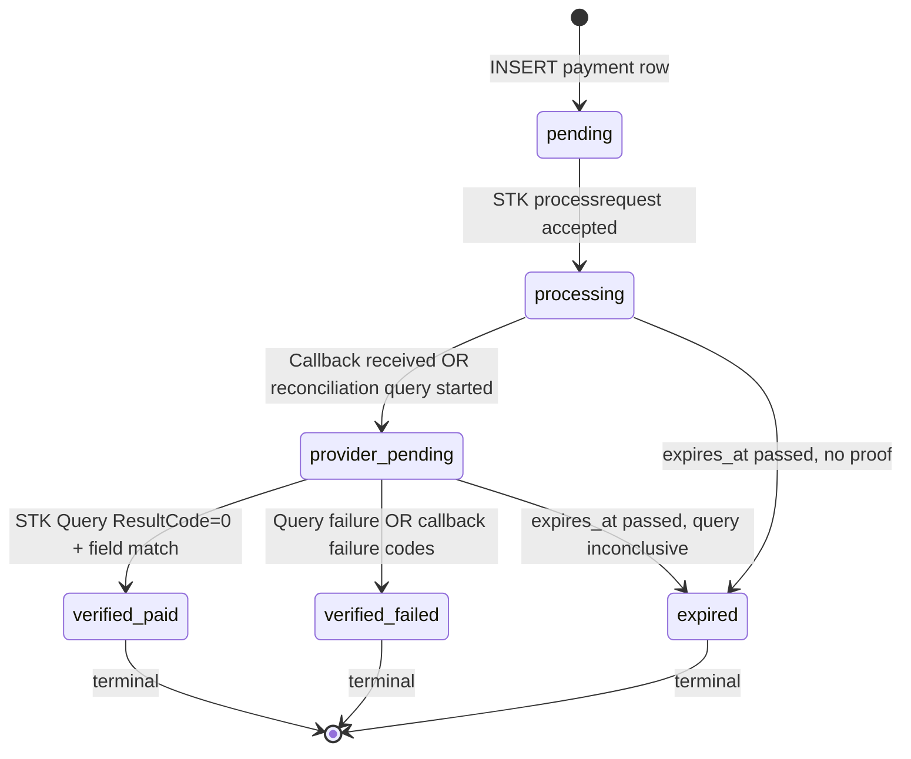

# ARCHITECT-AMENDMENT — Phase 03 Payment Trust

## Executive summary

Phase 03 closes the **money trust** fault line: today `/api/mpesa/callback` is public, trusts attacker-supplied `checkoutRequestId` + `resultCode` + receipt text, and activates subscriptions without independent Daraja proof. The STK-push route leaks `checkoutRequestId` to the client and auto-pays on `isMock`.

**DEC-010 resolved: Option (A).** Safaricom Daraja Lipa na M-Pesa Online does **not** sign STK Push callbacks. Nexus will use an **opaque per-payment callback secret embedded in `CallBackURL`** plus **mandatory Lipa na M-Pesa Online Query (STK Query)** server-to-server verification before any entitlement activation. Callbacks are **notifications only**; they trigger verification, never proof.

**Verdict: `READY_FOR_PLANNING_AMENDMENT`**

---

## Patterns and conventions found

| Pattern | Location | Phase 03 reuse |
|---------|----------|----------------|
| Route Handler + Zod + session auth | `src/app/api/mpesa/stk-push/route.ts` | Keep session boundary on stk-push and new status poll |
| Service-role after auth | `createAdminClient()` post `getUser()` | Unchanged; webhook routes use service-role with secret gate |
| Provider mode fail-closed | `src/lib/env/providerModes.ts` (Phase 02) | `assertMpesaConfiguredForLiveMode()` already blocks live without creds; remove mock-paid branch |
| Daraja client | `src/lib/mpesa/mpesaClient.ts` | Extend with `queryStkPush()`; per-payment `CallBackURL` |
| Subscription activation | `subscriptionService.activateSubscriptionFromPayment()` | Gate behind `verified-paid` + query proof record |
| Billing idempotency (partial) | `billingEventExists(mpesaPaymentId, "payment_received")` | Strengthen with DB uniqueness + atomic RPC |
| Callback ledger | `mpesa_callbacks` table | Evolve to `mpesa_callback_events` with unique idempotency key |
| Notification side effects | `notificationService.sendPaymentSuccessNotifications()` | Fire only after verified-paid transition |
| Celcom delivery updates | `handleCelcomDeliveryReport()` in `notificationService.ts` | Add secret header + idempotency table |
| Pricing UI | `src/features/pricing/components/PricingCheckout.tsx` | Poll `mpesaPaymentId`; no checkout ID in client state |

**Current P0 defects (verified in code):**

```25:68:src/app/api/mpesa/callback/route.ts
export async function POST(request: Request) {
  // ... no auth, no secret, no STK Query ...
  if (parsed.resultCode === 0 && parsed.mpesaReceiptNumber) {
    await markPaymentPaidFromCallback({ ... });
    const activation = await activateSubscriptionFromPayment(payment.id);
```

```156:191:src/app/api/mpesa/stk-push/route.ts
    if (stkResult.isMock) {
      // ... marks paid + activates without Daraja ...
    }
    return NextResponse.json({
      data: {
        checkoutRequestId: stkResult.checkoutRequestId,  // leaked to client
        isMock: stkResult.isMock,
```

```27:42:supabase/migrations/20250613120200_create_billing_notifications.sql
  payment_status TEXT NOT NULL DEFAULT 'pending'
    CHECK (payment_status IN ('pending', 'processing', 'paid', 'failed', 'cancelled', 'expired', 'refunded')),
  -- no unique on mpesa_receipt_number; no callback_secret_hash
```

---

## Daraja primary contract (research)

Safaricom **Daraja 3.0 — Lipa na M-Pesa Online** APIs. Official portal paths (primary names):

| API | Method | Path | Role |
|-----|--------|------|------|
| **OAuth** | `GET` | `/oauth/v1/generate?grant_type=client_credentials` | Bearer token for Daraja calls |
| **Lipa na M-Pesa Online Payment** (STK Push) | `POST` | `/mpesa/stkpush/v1/processrequest` | Initiate STK prompt; returns `CheckoutRequestID` / `MerchantRequestID` |
| **Lipa na M-Pesa Online Query** (STK Query) | `POST` | `/mpesa/stkpushquery/v1/query` | Independent status check by `CheckoutRequestID` |

**Base URLs** (already in `mpesaClient.ts`):

- Sandbox: `https://sandbox.safaricom.co.ke`
- Production: `https://api.safaricom.co.ke`

**STK Push request** (`processrequest`): `BusinessShortCode`, Base64 `Password` (shortcode + passkey + timestamp), `Timestamp`, `TransactionType` (`CustomerPayBillOnline`), `Amount`, `PartyA`/`PhoneNumber` (254…), `PartyB`, **`CallBackURL`** (HTTPS), `AccountReference`, `TransactionDesc`.

**STK Push synchronous response**: acknowledgement only — `CheckoutRequestID` means Daraja accepted the push request, **not** that the customer paid.

**STK Push callback** (async `POST` to `CallBackURL`): JSON body with `Body.stkCallback` containing `MerchantRequestID`, `CheckoutRequestID`, `ResultCode`, `ResultDesc`, and on success `CallbackMetadata.Item[]` (`Amount`, `MpesaReceiptNumber`, `PhoneNumber`, `TransactionDate`). Nexus already parses this in `parseMpesaCallbackPayload()`.

**STK Query request** (`query`): same auth/password pattern; body includes `BusinessShortCode`, `Password`, `Timestamp`, **`CheckoutRequestID`**.

**STK Query response**: `ResultCode`, `ResultDesc`, `CheckoutRequestID` — `ResultCode === 0` means the STK transaction completed successfully per Daraja records. Use as **independent proof** before activation; cross-check amount/phone against payment row when callback metadata is present.

**Callback response obligation**: return HTTP **200** with `{ "ResultCode": 0, "ResultDesc": "Accepted" }` (`buildMpesaAcceptResponse()`). Non-200 causes Safaricom retries.

### Webhook signatures — confirmed absent

**Safaricom Daraja does NOT provide HMAC or signature headers on standard Lipa na M-Pesa Online STK callbacks.** There is no official `X-Mpesa-Signature` or equivalent in the Daraja STK callback contract. Third-party relay libraries add their own signing layer; Nexus must **not invent** a Daraja signature header.

**Implication:** Option (B) IP allowlist alone is insufficient (spoofing from allowed networks, NAT, CDN changes). Option (C) manual ops is unacceptable for production. **Option (A) is the correct provider-aligned design.**

**Optional defense-in-depth (not primary):** Safaricom egress IP allowlist as supplemental filter; never sole trust.

**References:**

- Safaricom Developer Portal — Lipa na M-Pesa Online: `https://developer.safaricom.co.ke/lipa-na-m-pesa-online/apis/post/stkpush/v1/processrequest`
- STK Query: `https://developer.safaricom.co.ke/lipa-na-m-pesa-online/apis/post/stkpushquery/v1/query`
- Daraja portal index: `https://developer.safaricom.co.ke/apis`

---

## DEC-010 resolution

| Field | Value |
|-------|-------|
| **Decision ID** | DEC-010 |
| **Selected** | **(A) Opaque per-payment callback secret in URL path + STK Query reconciliation before activation** |
| **Rejected** | (B) IP allowlist only; (C) manual ops delay |
| **Authority** | Provider contract (no callback signatures) + security constraint |
| **Ledger** | PR-001, PR-002, PR-003, PR-124, PR-056, PR-094–PR-096, PR-111, PR-113–PR-115, PR-123, PR-140 |

### Option (A) design

1. On payment row creation, generate `callback_secret` (≥32 bytes, `crypto.randomBytes`, base64url).
2. Store **`callback_secret_hash`** only (`SHA-256` or `HMAC-SHA256` with server pepper `MPESA_CALLBACK_PEPPER`); never persist raw secret after STK initiation.
3. Register Daraja `CallBackURL` = `{APP_ORIGIN}/api/mpesa/callback/{callback_secret}` (per payment, not global).
4. Callback route extracts secret from path; **constant-time compare** against hash for matching `mpesa_payments` row.
5. On valid secret + parseable callback: log event idempotently → transition to `provider-pending` → **`queryStkPush(checkoutRequestId)`** → if query `ResultCode === 0` and amount/phone/plan match → `verified-paid` → activation.
6. Callback `resultCode` / receipt alone **never** activate; mismatch between callback and query → `verified-failed` + security log, no rollback from `verified-paid`.

---

## Architecture decision

**Single pipeline: notification → query proof → monotonic state machine → atomic activation.**

| Choice | Rationale | Trade-off |
|--------|-----------|-----------|
| Per-payment URL secret | Daraja has no signature; secret is unguessable capability URL | Longer `CallBackURL`; secret in URL logs — mitigate with hash-at-rest, no secret in app logs |
| STK Query mandatory before activation | Official independent proof channel | Extra Daraja API call per callback; rate-limit aware |
| Callback triggers async verification | Meets Daraja 200-fast-response requirement | Requires worker-style `waitUntil` or inline query with timeout budget |
| `verified-paid` terminal state | Distinguishes “Daraja-proved paid” from legacy `paid` | Migration extends CHECK constraint |
| Postgres RPC for transitions | Eliminates check-then-insert races (PR-056, PR-092) | Phase 05 may further unify activation RPC |

---

## Full journey trace

```
/pricing (PricingCheckout.tsx)
  → POST /api/mpesa/stk-push
      → createClient().auth.getUser()                         [session]
      → student_profiles ownership
      → mpesaStkPushSchema (phone +254…, plan UUID)
      → duplicate-pending guard (student_id + plan, active statuses)
      → getEffectiveSubscriptionConfig() + resolvePlanAmountKes()
      → INSERT mpesa_payments
            status=pending
            callback_secret_hash
            expires_at (e.g. now + 5m)
      → generate raw callback_secret (memory only)
      → initiateStkPush({ CallBackURL: .../callback/{secret}, ... })
            POST /mpesa/stkpush/v1/processrequest
      → UPDATE status=processing, checkout_request_id, merchant_request_id
      → JSON { mpesaPaymentId, amountKes, expiresAt }         [NO checkoutRequestId, NO isMock]

Student phone (Safaricom)
  → STK prompt → customer PIN

Safaricom Daraja
  → POST {APP_ORIGIN}/api/mpesa/callback/{callback_secret}
      → extract secret from path
      → lookup payment by secret hash (constant-time)
      → 403 if unknown secret (do NOT return Daraja accept body to forgeries)
      → parseMpesaCallbackPayload(body)
      → INSERT mpesa_callback_events ON CONFLICT DO NOTHING   [idempotency key]
      → if duplicate event → 200 Accepted, stop
      → UPDATE payment status=provider-pending (monotonic guard)
      → queryStkPush(checkoutRequestId)
            POST /mpesa/stkpushquery/v1/query
      → validate query ResultCode, amount, phone vs payment row + platform price
      → if proof OK:
            transition verified-paid (unique receipt constraint)
            → activate_subscription_from_payment() RPC         [atomic]
            → billing_events, payment_transactions, invoices
            → student_subscriptions UPSERT
            → family: createFamilyGroupForPayment if family plan
            → sendPaymentSuccessNotifications()
      → if proof FAIL:
            transition verified-failed (or remain processing if query timeout → reconciliation)
      → return buildMpesaAcceptResponse()                     [always 200 to Daraja]

Student UI (poll)
  → GET /api/mpesa/status?mpesaPaymentId={uuid}
      → session auth + payment.student_id ownership
      → return { status, expiresAt, planName }                [no receipt, no checkout ID]

Reconciliation job (cron / admin stub PR-077)
  → SELECT processing|provider-pending WHERE expires_at < now()
  → STK Query each checkout_request_id
  → converge to verified-paid | verified-failed | expired
  → never downgrade verified-paid

Celcom (parallel hardening)
  → POST /api/celcom/webhook
      → Header X-Celcom-Webhook-Secret vs CELCOM_WEBHOOK_SECRET (constant-time)
      → INSERT celcom_webhook_events idempotency
      → update celcom_sms_logs delivery state
```

**Tables touched:** `mpesa_payments`, `mpesa_callback_events` (evolved from `mpesa_callbacks`), `student_subscriptions`, `subscription_plans`, `billing_events`, `payment_transactions`, `invoices`, `family_groups`, `celcom_sms_logs`, `celcom_webhook_events` (new).

---

## Payment state machine

### States (monotonic)



| State | Meaning | Client-visible label |
|-------|---------|---------------------|
| `pending` | Row created; STK not yet confirmed | “Starting payment…” |
| `processing` | Daraja accepted STK; awaiting customer | “Check your phone” |
| `provider-pending` | Callback or reconciliation in flight; query running | “Confirming payment…” |
| `verified-paid` | Daraja query proof OK; activation allowed | “Payment successful” |
| `verified-failed` | Proof rejected (cancelled, wrong amount, mismatch) | “Payment failed” |
| `expired` | No proof before `expires_at` | “Payment timed out — try again” |

### Transition rules

1. **Monotonic:** `verified-paid` is terminal — no transition to `verified-failed`, `expired`, or `processing`.
2. **No activation before `verified-paid`:** `activateSubscriptionFromPayment()` refuses unless `payment_status = 'verified-paid'` and `stk_query_verified_at IS NOT NULL`.
3. **Legacy mapping:** migrate existing `paid` → `verified-paid` where `mpesa_receipt_number` present; `failed`/`cancelled` → `verified-failed`.
4. **Daraja result codes** (existing `mapMpesaResultCodeToStatus`): `0` → candidate for query proof; `1032` → cancelled; `1037` → expired; others → failed. Callback codes inform UI hints only until query confirms.
5. **Duplicate pending suppression (PR-114):** at most one row in `(pending|processing|provider-pending)` per `(student_id, subscription_plan_id)`; second STK returns existing `mpesaPaymentId` if still valid.

### DB enforcement

```sql
-- CHECK constraint replacement (migration)
payment_status IN (
  'pending', 'processing', 'provider-pending',
  'verified-paid', 'verified-failed', 'expired',
  'refunded'  -- ops manual only
)

-- Monotonic transition trigger or RPC guards:
-- verified-paid → * is forbidden
```

---

## Component design

### `src/lib/mpesa/mpesaClient.ts` (extend)

| Export | Responsibility |
|--------|----------------|
| `initiateStkPush(params & { callbackUrl: string })` | Require explicit per-payment `CallBackURL`; remove mock from live path |
| `queryStkPush(checkoutRequestId: string)` | **New.** `POST /mpesa/stkpushquery/v1/query`; return `{ resultCode, resultDesc, checkoutRequestId }` |
| `parseMpesaCallbackPayload` | Unchanged |
| `buildMpesaAcceptResponse` | Unchanged |
| `formatPhoneForDaraja` | Unchanged |

### `src/lib/mpesa/paymentProof.ts` (new)

| Function | Responsibility |
|----------|----------------|
| `generateCallbackSecret()` | 32-byte random base64url |
| `hashCallbackSecret(secret)` | HMAC-SHA256 with pepper |
| `verifyCallbackSecret(secret, hash)` | `crypto.timingSafeEqual` |
| `buildCallbackUrl(secret)` | `{APP_ORIGIN}/api/mpesa/callback/{secret}` |
| `validateQueryProof(payment, queryResult, callbackMeta?)` | Amount, phone, shortcode, receipt uniqueness |

### `src/lib/mpesa/paymentStateMachine.ts` (new)

| Function | Responsibility |
|----------|----------------|
| `canTransition(from, to)` | Monotonic matrix |
| `mapDarajaResultToHint(code)` | UI hint only, not activation |
| `isTerminal(status)` | `verified-paid`, `verified-failed`, `expired`, `refunded` |

### `src/app/api/mpesa/callback/[secret]/route.ts` (relocate)

Move from flat `/api/mpesa/callback/route.ts` to dynamic segment. Verify secret → log event → query → RPC transition.

### `src/app/api/mpesa/stk-push/route.ts` (modify)

Remove mock-paid block; generate secret; suppress duplicate pending; response shape `{ mpesaPaymentId, amountKes, expiresAt }`.

### `src/app/api/mpesa/status/route.ts` (new)

`GET` with session; query param `mpesaPaymentId`; verify `payment.student_id` matches profile; return sanitized status.

### `src/server/services/paymentReconciliationService.ts` (new)

`expireStalePayments()`, `reconcilePayment(paymentId)`, `replayCallbackEvent(eventId)` (PR-077 stub).

### `src/server/services/subscriptionService.ts` (modify)

- `activateSubscriptionFromPayment` — require `verified-paid`.
- Replace `isCallbackAlreadyProcessed` with DB unique insert pattern.
- Add `findPaymentByCallbackSecretHash`.

### `src/app/api/celcom/webhook/route.ts` (modify)

Verify `X-Celcom-Webhook-Secret` (or `Authorization: Bearer`) against `CELCOM_WEBHOOK_SECRET`; idempotent event insert before `handleCelcomDeliveryReport`.

### `src/features/pricing/components/PricingCheckout.tsx` (modify)

After STK: poll `/api/mpesa/status` every 2–3s until terminal; show PR-140 recovery copy for failed/expired/provider-down.

---

## DB migration design

**File:** `supabase/migrations/20260701090000_payment_idempotency.sql`

### Schema changes

```sql
-- mpesa_payments
ALTER TABLE public.mpesa_payments
  ADD COLUMN callback_secret_hash TEXT,
  ADD COLUMN stk_query_verified_at TIMESTAMPTZ,
  ADD COLUMN stk_query_result_code INTEGER,
  ADD COLUMN provider_pending_at TIMESTAMPTZ;

-- Extend status enum (see state machine)
ALTER TABLE public.mpesa_payments
  DROP CONSTRAINT IF EXISTS mpesa_payments_payment_status_check;
ALTER TABLE public.mpesa_payments
  ADD CONSTRAINT mpesa_payments_payment_status_check
  CHECK (payment_status IN (
    'pending', 'processing', 'provider-pending',
    'verified-paid', 'verified-failed', 'expired', 'refunded'
  ));

-- Receipt uniqueness (PR-096)
CREATE UNIQUE INDEX uq_mpesa_payments_receipt
  ON public.mpesa_payments (mpesa_receipt_number)
  WHERE mpesa_receipt_number IS NOT NULL;

-- One active attempt per student+plan (PR-114)
CREATE UNIQUE INDEX uq_mpesa_payments_active_student_plan
  ON public.mpesa_payments (student_id, subscription_plan_id)
  WHERE payment_status IN ('pending', 'processing', 'provider-pending');

-- Callback events (evolve mpesa_callbacks)
ALTER TABLE public.mpesa_callbacks
  RENAME TO mpesa_callback_events;

ALTER TABLE public.mpesa_callback_events
  ADD COLUMN idempotency_key TEXT NOT NULL DEFAULT '',
  ADD COLUMN event_source TEXT NOT NULL DEFAULT 'daraja_callback'
    CHECK (event_source IN ('daraja_callback', 'stk_query', 'reconciliation'));

-- Idempotency: one processed outcome per checkout+result (+ receipt when present)
CREATE UNIQUE INDEX uq_mpesa_callback_events_idempotency
  ON public.mpesa_callback_events (idempotency_key);

-- Celcom webhook idempotency (PR-111)
CREATE TABLE public.celcom_webhook_events (
  id UUID PRIMARY KEY DEFAULT gen_random_uuid(),
  idempotency_key TEXT NOT NULL UNIQUE,
  celcom_message_id TEXT,
  payload JSONB NOT NULL,
  processed_at TIMESTAMPTZ NOT NULL DEFAULT NOW()
);
```

### Atomic functions (`SECURITY DEFINER`, `search_path = public`)

| Function | Purpose |
|----------|---------|
| `transition_mpesa_payment(p_payment_id, p_to_status, p_expected_from text[])` | Row-lock payment; enforce `canTransition`; set timestamps |
| `record_mpesa_callback_event(p_idempotency_key, ...)` | `INSERT … ON CONFLICT DO NOTHING RETURNING id`; signals duplicate |
| `verify_and_mark_mpesa_paid(p_payment_id, p_receipt, p_query_result_code, p_query_payload)` | Unique receipt + transition to `verified-paid` atomically |
| `activate_subscription_from_payment(p_payment_id)` | **Move from Phase 05 plan into Phase 03 minimum viable** — single transaction: billing_event idempotency, subscription insert, invoice, payment_transaction |

**Idempotency key format:**

- Callback: `stk:{checkout_request_id}:{result_code}:{mpesa_receipt_number|none}`
- Celcom: `celcom:{messageId}:{status}:{event_timestamp|none}`

---

## Security

| Control | Implementation |
|---------|----------------|
| Callback auth | Per-payment secret in URL; hash at rest; **constant-time** compare via `timingSafeEqual` on fixed-length digests |
| No checkout ID as proof | Remove from stk-push JSON response; adversarial tests assert client cannot activate with leaked ID |
| STK Query as proof | `queryStkPush` before `verified-paid`; callback alone insufficient |
| Amount/plan match (PR-094) | `resolvePlanAmountKes(plan_code)` vs query/callback amount; reject mismatch |
| Phone validation (PR-095) | Existing Zod `+254[17]…`; normalize to 254 for Daraja compare |
| Student poll auth (PR-113) | Session required; `mpesaPaymentId` must belong to authenticated `student_profiles.id` |
| Poll response hygiene | Return `status`, `expiresAt`, `failureHint` only — no `checkoutRequestId`, receipt, or secret |
| Forged callback | Wrong/missing secret → HTTP 403, no Daraja accept body (optional: still 200 with no processing to avoid retry storms on wrong URLs — **prefer 403** for unknown secret, **200 accept** only after valid secret lookup) |
| Rate limits (PR-047) | Burst limit stk-push + callback by IP HMAC + student_id (Phase 05 durable table; Phase 03 in-memory acceptable only if documented as interim) |
| Mock path (PR-004) | Delete stk-push `isMock` paid branch; `isMpesaMockAllowed()` only in test with explicit adapter injection, never production |
| Logging | Never log raw `callback_secret`, Daraja password, or full callback PII; structured `MPESA_PAYMENT_VERIFY_FAILED` codes |

**Clarification on 403 vs 200 for bad secret:** Unknown secret → **403** (attacker probing). Valid secret, malformed body → **200 Accepted** (stop Daraja retries, no state change).

---

## Celcom webhook (PR-111)

| Item | Design |
|------|--------|
| Secret | Env `CELCOM_WEBHOOK_SECRET`; header `X-Celcom-Webhook-Secret` |
| Verification | `timingSafeEqual` on constant-length buffers |
| Idempotency | `celcom_webhook_events.idempotency_key` unique before updating `celcom_sms_logs` |
| Failure | 401 on bad secret; 200 on duplicate event |
| Mock | Phase 02 fail-closed; no fake `delivered` without verified webhook in production |

---

## Test strategy

| Suite | File | Adversarial cases |
|-------|------|-------------------|
| Forgery | `tests/mpesa/callbackForgery.test.ts` | Unsigned POST to old `/callback` path; wrong secret; forged success body with guessed `checkoutRequestId`; no subscription change |
| Replay | `tests/mpesa/callbackReplay.test.ts` | Same idempotency key twice; reordered success then failure; Daraja retry duplicate |
| Race | `tests/mpesa/paymentConcurrency.test.ts` | 20 parallel identical verified callbacks → one `verified-paid`, one activation, one notification intent |
| Query proof | `tests/mpesa/stkQueryProof.test.ts` | Callback success but query `ResultCode != 0` → no activation; query success with wrong amount → `verified-failed` |
| Mismatch | (in forgery/proof) | Wrong phone, wrong amount, wrong plan price, unknown checkout ID |
| STK push | `tests/mpesa/stkPushResponse.test.ts` | Response excludes `checkoutRequestId`; prod fixture rejects mock paid |
| Celcom | `tests/mpesa/celcomWebhook.test.ts` | Missing secret; replay messageId |
| Expiry | `tests/mpesa/paymentExpiry.test.ts` | Stale `processing` → `expired` via reconciliation |
| Duplicate pending | `tests/mpesa/duplicatePending.test.ts` | Double-click STK → single active row |

**Mocking:** Mock `queryStkPush` and Daraja fetch in unit tests; no real charges without explicit authorization (Phase 12 staging evidence).

---

## Implementation map (Planner allowlist alignment)

| File | Action |
|------|--------|
| `src/app/api/mpesa/callback/[secret]/route.ts` | **Create** (replace flat route) |
| `src/app/api/mpesa/callback/route.ts` | **Delete** or 410 redirect |
| `src/app/api/mpesa/stk-push/route.ts` | Secret generation, remove mock-paid, strip checkout ID from response |
| `src/app/api/mpesa/status/route.ts` | **Create** authenticated poll |
| `src/lib/mpesa/mpesaClient.ts` | Add `queryStkPush`; per-payment callback URL |
| `src/lib/mpesa/paymentProof.ts` | **Create** |
| `src/lib/mpesa/paymentStateMachine.ts` | **Create** |
| `src/server/services/subscriptionService.ts` | Gate activation; callback event helpers |
| `src/server/services/paymentReconciliationService.ts` | **Create** |
| `src/app/api/celcom/webhook/route.ts` | Secret + idempotency |
| `src/features/pricing/components/PricingCheckout.tsx` | Poll + recovery UI |
| `src/schemas/mpesaSchemas.ts` | Status poll query schema if needed |
| `supabase/migrations/20260701090000_payment_idempotency.sql` | **Create** |
| `tests/mpesa/*.test.ts` | Per PHASE-PLAN allowlist |

---

## Build sequence

- [ ] **1. Migration** — status values, `callback_secret_hash`, unique receipt, idempotency indexes, RPC stubs
- [ ] **2. `paymentProof` + `paymentStateMachine`** — pure functions with unit tests
- [ ] **3. `queryStkPush` in mpesaClient** — sandbox integration test optional
- [ ] **4. RED adversarial tests** — forgery/replay/race fail against current code
- [ ] **5. Callback route `[secret]`** — secret verify → event log → query → transition
- [ ] **6. STK-push hardening** — secret gen, duplicate guard, response shape
- [ ] **7. Status poll endpoint** — auth + ownership
- [ ] **8. Activation gate** — `verified-paid` only; wire notifications
- [ ] **9. Celcom webhook** — secret + idempotency
- [ ] **10. Pricing UI poll** — terminal states, PR-140 copy
- [ ] **11. Reconciliation stub** — expire + query sweep
- [ ] **12. GREEN full `tests/mpesa/` suite**

---

## Ledger coverage

| ID | Amendment section |
|----|-------------------|
| PR-001 | DEC-010 (A), callback secret, query proof |
| PR-002 | No checkout ID to client; query required |
| PR-003 | Callback event idempotency key |
| PR-004 | Remove mock-paid path |
| PR-056 | Unique idempotency + atomic insert |
| PR-094 | Amount/plan validation in `validateQueryProof` |
| PR-095 | Phone Zod + Daraja normalize |
| PR-096 | Unique `mpesa_receipt_number` |
| PR-111 | Celcom secret + idempotency |
| PR-113 | `/api/mpesa/status` authenticated poll |
| PR-114 | Unique partial index active student+plan |
| PR-115 | `expires_at` + reconciliation → `expired` |
| PR-123 | Pricing poll recovery |
| PR-124 | Mandatory `queryStkPush` before activation |
| PR-140 | UI pending/error/recover states |
| PR-047 | Burst limits (interim + Phase 05 durable) |
| PR-077 | Reconciliation/replay stub in `paymentReconciliationService` |

---

## Critical details

| Area | Requirement |
|------|-------------|
| **Error handling** | Callback always 200 to Daraja after valid secret lookup; internal errors logged, reconciliation converges |
| **Performance** | STK Query inline with ≤8s timeout; fallback reconciliation for slow Daraja |
| **Phase 05 handoff** | Full `activate_subscription_from_payment` RPC may deepen in Phase 05; Phase 03 ships minimum atomic version |
| **Phase 02 dependency** | `assertMpesaConfiguredForLiveMode()` must pass before live STK; satisfied by Phase 02 PASS |
| **Ops** | `MPESA_CALLBACK_PEPPER` rotation requires new payments only; document in runbook (Phase 12 PR-076) |

---

## Open questions (non-blocking)

1. **Callback route shape:** Planner may choose `[secret]` dynamic segment vs query param `?t=` — path segment preferred (opaque, non-logged in query strings on intermediaries).
2. **Celcom header name:** Confirm with Celcom integration docs; default `X-Celcom-Webhook-Secret` with env override.
3. **IP allowlist:** Optional `MPESA_WEBHOOK_ALLOWED_IPS` supplemental — not DEC-010 primary.

---

## Verdict

**`READY_FOR_PLANNING_AMENDMENT`**

DEC-010 is resolved with provider-cited Option (A). The payment journey, state machine, migration design, Celcom parity, security controls, and adversarial test matrix are specified sufficiently for Planner to amend Phase 03 `PHASE-PLAN.md` with `APPROVED_TO_BUILD` and unchanged file allowlist.

**Planner actions:**

1. Update `DECISION-REGISTER.md` DEC-010 → **SELECTED: (A)** with link to this amendment.
2. Amend Phase 03 tasks to reference `callback/[secret]` route relocation.
3. Unblock Coder after `APPROVED_TO_BUILD`.
