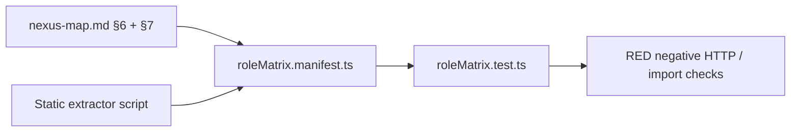

# ARCHITECT-AMENDMENT — Phase 04 Authentication, Authorization, and Account Consistency

## Executive summary

Phase 04 closes four coupled authorization/account faults: **support login is broken** because `authService` rejects the `support` role while `proxy.ts` admits it; **`/admin/usage-stats` SSR bypasses** the super-admin API guard and loads service-role Nex flagged content for support; **OAuth bypasses beta invite policy** when `BETA_INVITE_REQUIRED=true`; and **signup + invite consumption is non-transactional**, leaving orphan accounts on race or late failure.

**DEC-003 recommendation: SELECT (A)** — enforce identical fail-closed beta policy on email signup and OAuth (server-side, not UI-only).

**Verdict: `READY_FOR_PLANNING_AMENDMENT`**

---

## Patterns and conventions found

| Pattern | Location | Phase 04 reuse |
|---------|----------|----------------|
| Canonical role claim | `user.app_metadata.userRole` | `nexus-map.md` §4; all guards read this |
| Admin page guard | `requireAdminRole(ADMIN_ROLES)` or `requireSuperAdmin()` + `redirect("/login")` | Fix usage-stats to match nex-ops / platform-settings |
| Admin API guard | `requireAdminApi(request, roles)` → stable `{ success, error: { code, message } }` | Role matrix negative tests |
| Session user (app shell) | `getSessionUser()` in `authService.ts` | Must admit `support`; drives login redirect |
| Proxy edge gate | `src/proxy.ts` — thin session + role redirect | Already admits `support` to `/admin/**`; not a substitute for page guards |
| Student gate | `requireStudentExperience()` in `features/student/server/` | Matrix: student pages + APIs |
| Content author gate | `requireContentAuthor()` in `server/services/contentAuthorGuard.ts` | Super-admin-only Studio surfaces |
| Beta invite | `betaInviteService.ts` — validate + optimistic `consumeInvite` | Extend with reservation RPC or compensating rollback |
| Existing proxy contract test | `tests/admin/adminMiddlewareSupport.test.ts` | Extend auth suite, not duplicate |

**Role type is already complete in `database.ts`:**

```3:3:src/types/database.ts
export type UserRole = "student" | "parent" | "super_admin" | "support";
```

**Defect: `authService` whitelist omits `support`:**

```13:23:src/server/services/authService.ts
function getRoleFromAppMetadata(
  appMetadata: Record<string, unknown> | undefined,
): UserRole | null {
  const role = appMetadata?.userRole;

  if (role === "student" || role === "parent" || role === "super_admin") {
    return role;
  }

  return null;
}
```

**Contrast: `superAdminGuard` admits support without whitelist truncation:**

```12:13:src/server/services/superAdminGuard.ts
export const ADMIN_ROLES = ["super_admin", "support"] as const;
```

---

## 1. Root cause — support login failure

### Symptom

Support user with valid Supabase session and `app_metadata.userRole = "support"` sees **"Unable to load your account. Contact support."** after password login (`PR-088`).

### Trace

```
/login → loginAction (authActions.ts)
  → supabase.auth.signInWithPassword()          ✓ session cookie set
  → getSessionUser() (authService.ts)
      → supabase.auth.getUser()                 ✓ user returned
      → getRoleFromAppMetadata(app_metadata)
          userRole === "support"                ✗ not in whitelist → null
      → return null
  → loginAction: sessionUser missing → error message
```

Parallel paths:

| Layer | Support handling | Result |
|-------|------------------|--------|
| `proxy.ts` L211–213, L343–347 | `support` treated as admin | `/admin/**` reachable if session cookie exists |
| `superAdminGuard.ts` | `ADMIN_ROLES` includes `support` | API/page guards that call it work |
| `getSessionUser()` | `support` → `null` | Login action fails; any code using `getSessionUser` treats support as logged-out |
| `getPostAuthRedirectPath()` | No `support` case → `default: "/login"` | Even a patched `getSessionUser` would mis-route without this fix |

### Fix (decisive)

1. **`getRoleFromAppMetadata`** — add `"support"` to the allowlist (mirror `UserRole` type; single shared helper preferred over duplicating logic in `superAdminGuard`).
2. **`getPostAuthRedirectPath`** — add `case "support": return "/admin/platform-settings"` (matches `proxy.ts` public-auth redirect target).
3. **`getSessionUser`** — no profile fetch for support (same as super_admin); return `{ id, email, role: "support", studentProfile: null, parentProfile: null }`.
4. **Regression test** — `tests/auth/supportLoginRouting.test.ts`: mock `app_metadata.userRole = "support"` → `getSessionUser` non-null; `getPostAuthRedirectPath` → `/admin/platform-settings`; `loginAction` redirects (integration or handler-level).

**Out of scope for Phase 04:** syncing `admin_role_assignments` ledger to Auth metadata (Phase 06 / DEC-008).

---

## 2. Usage-stats SSR bypass trace (P1.2 / PR-013)

### Symptom

Support can view Nex cost aggregates and **raw flagged conversation bodies** on `/admin/usage-stats` while the JSON API correctly returns 403.

### Trace

```
GET /admin/usage-stats
  → proxy.ts: isSuperAdminRoute
      user present, role === "support"          ✓ admitted (L343–347)
  → usage-stats/page.tsx (Server Component)
      NO requireSuperAdmin() / requireAdminRole()
      → loadNexOpsSnapshot() (nexOpsService.ts)
          → createAdminClient()               service-role bypass
          → reads nex_messages, flagged content, cost aggregates
      → HTML rendered with NexOpsReviewPanel initialItems={snapshot.flagged}
```

API path (correct):

```
GET /api/admin/usage-stats
  → requireSuperAdmin()                         ✓ support → 403
  → loadNexOpsSnapshot()
```

### Comparison with sibling page

`/admin/nex-ops/page.tsx` calls `requireAdminRole(ADMIN_ROLES)` before any service-role read — support sees ops summary **without** super-admin-only usage-stats review panel semantics per `nexus-map.md` §6.4.

### Fix (decisive)

Mirror API policy on the page:

```typescript
// usage-stats/page.tsx — before loadNexOpsSnapshot()
const auth = await requireSuperAdmin();
if (!auth.ok) {
  redirect("/login"); // or /admin with 403 pattern if product prefers
}
```

**Audit rule (PR-142 render-path parity):** any Server Component that calls `createAdminClient()` or a service wrapping it must call an explicit role guard first; proxy admission is necessary but not sufficient.

---

## 3. OAuth beta bypass trace (PR-055 / DEC-003)

### Symptom

When `BETA_INVITE_REQUIRED=true`, email signup cannot proceed without a valid invite, but Google OAuth can still provision a full student/parent account.

### Trace — email path (enforced)

```
/signup (betaInviteRequired=true)
  → AuthForm: invite field required; Google button HIDDEN (L250: !betaInviteRequired)
  → signupAction
      → validateInviteCode()                    ✓ gate
      → signUp → setUserRole → createProfile
      → consumeInvite()                         ✓ gate
```

### Trace — OAuth path (bypass)

```
[Entry A] signup UI when beta OFF shows Google — not the beta case
[Entry B] signInWithGoogleAction(role)          NO isBetaInviteRequired() check
      → signInWithOAuth({ redirectTo: /auth/callback?role=... })
[Entry C] Direct /auth/callback?code=...&role=student
      → exchangeCodeForSession()                ✓
      → NO validateInviteCode / consumeInvite
      → setUserRole(user.id, role)              ✓ account created
      → createStudentProfile / createParentProfile ✓
      → redirect to onboarding/parent
```

UI hiding the Google button (`AuthForm.tsx` L250) is **not** a security control — server actions and crafted OAuth redirects bypass it.

### DEC-003 recommendation: **SELECT (A) — fail-closed OAuth beta parity**

| Option | Verdict |
|--------|---------|
| **(A) Identical beta policy on email + OAuth** | **SELECT** — matches security default in DECISION-REGISTER; closes bypass |
| (B) OAuth without invite in beta | Rejected — creates two signup classes; undermines private beta |
| (C) Disable OAuth in beta | Acceptable fallback but worse UX; unnecessary if (A) implemented |

### Implementation design for (A)

**Approach:** carry invite through OAuth `state`, validate server-side before account mutation.

```
signInWithGoogleAction(role, inviteCode?)
  → if isBetaInviteRequired():
        require inviteCode; validateInviteCode()
  → signInWithOAuth({
        redirectTo: `${appUrl}/auth/callback?role=${role}`,
        queryParams: { ... },
        // Supabase: pass invite in options or encode in redirectTo:
        // redirectTo: `.../auth/callback?role=${role}&invite=${encodeURIComponent(code)}`
     })

/auth/callback GET
  → exchangeCodeForSession(code)
  → if isBetaInviteRequired() && !existingRole:
        read invite from searchParams (or parsed OAuth state)
        validateInviteCode(invite) → on fail redirect /signup?error=invite_required
        ... setUserRole, createProfile ...
        consumeInvite(invite) → on fail compensating rollback (§4)
  → else existing flow for returning users
```

**UI:** when `betaInviteRequired`, show Google button **with** invite field validation in `handleGoogleSignIn` (client) **and** enforce in `signInWithGoogleAction` + callback (server).

**Tests:** `tests/auth/oauthBetaPolicy.test.ts` — `BETA_INVITE_REQUIRED=true`, callback without invite → redirect/error, no profile row; with valid invite → profile + consumed invite.

**Authority note:** Architect recommends (A); Orchestrator should record DEC-003 **SELECTED: (A)** before Coder OAuth work. Planning may proceed with (A) as default per register.

---

## 4. Signup / invite race compensation design (PR-054)

### Current failure modes

`signupAction` order:

1. `signUp` (Auth user created — irreversible without admin delete)
2. `setUserRole`
3. `createStudentProfile` / `createParentProfile`
4. `consumeInvite` (optimistic lock on `use_count`)

| Failure | Orphan state |
|---------|--------------|
| Two parallel signups, one invite | Both pass `validateInviteCode`; both get profiles; one `consumeInvite` wins, other returns error **after** account exists |
| `consumeInvite` fails after profile create | Auth user + profile exist; user sees error; invite may still be available |
| `setUserRole` fails after `signUp` | Auth user without role/profile |

`consumeInvite` already uses conditional update (`eq use_count, validation.invite.use_count`) — good for single-winner consumption, not for signup atomicity.

### Architecture decision: **reserve-then-commit with compensating rollback**

**Primary:** Postgres RPC `reserve_beta_invite(p_code text, p_user_id uuid)`  
**Fallback compensation:** ordered rollback in application code when RPC unavailable (Phase 04 MVP).

#### RPC contract (new migration in Phase 04 allowlist)

```sql
-- reserve_beta_invite: atomically increment use_count if valid; tie to user_id in beta_invite_redemptions
-- Returns: { ok, invite_id, reason }
-- consume is idempotent per (invite_code, user_id) — replays succeed
```

Flow:

```
signupAction:
  1. validateInviteCode (fast fail, unchanged)
  2. signUp
  3. reserve_beta_invite(code, user.id)   -- atomic; fails if exhausted
  4. setUserRole
  5. createProfile
  on any failure after step 2:
     → release_beta_invite OR delete auth user + profile (compensating)
  on success:
     reservation already committed (idempotent replay safe)
```

#### Compensating rollback (application layer — required even with RPC)

New `src/server/services/signupCompensation.ts`:

```typescript
async function rollbackFailedSignup(userId: string, role: "student" | "parent"): Promise<void>
  → delete profile row (student_profiles | parent_profiles)
  → admin.auth.admin.deleteUser(userId)       // only for fresh signups < N minutes, no paid state
  → log SIGNUP_ROLLBACK for ops
```

**Guards on rollback:** skip delete if user has payments, messages, or `created_at` older than rollback window (5 min). Prefer leaving orphan + alert over deleting active user.

#### OAuth parity

Same `reserve_beta_invite` / `consumeInvite` idempotency in `/auth/callback` after DEC-003 (A).

#### Tests

`tests/auth/signupConcurrency.test.ts` — parallel `signupAction` with same invite → exactly one success, one invite-exhausted error, ≤1 profile.

---

## 5. Session revocation design (PR-127)

### Problem

No hook invalidates existing sessions when `app_metadata.userRole` changes, support is demoted, or account is disabled. Valid refresh tokens may continue until natural expiry.

### Architecture decision: **`session_version` in `app_metadata` + global `signOut` on critical demotions**

#### Model

```typescript
// app_metadata shape (additive)
{
  userRole: UserRole,
  sessionVersion: number  // monotonic int, default 1 on provision
}
```

#### Revocation service

New `src/server/services/sessionRevocationService.ts`:

```typescript
export async function revokeAllSessions(userId: string, reason: string): Promise<void>
  → admin.auth.admin.updateUserById(userId, {
      app_metadata: { ...existing, sessionVersion: (current ?? 1) + 1 }
    })
  → admin.auth.admin.signOut(userId, "global")

export async function bumpSessionVersion(userId: string): Promise<number>
  // used when global signOut is too disruptive (e.g. role upgrade)
```

#### Enforcement points

| Trigger | Action |
|---------|--------|
| `setUserRole()` role change | `revokeAllSessions` when role **changes** (not first assign) |
| Future: admin demote support → student | `revokeAllSessions` |
| Future: comp/grant impersonation end | optional bump (Phase 06) |

#### Request-time check

`getSessionUser`, `requireAdminRole`, and `proxy.getAuthContext` already call `getUser()` (server-validated). After `signOut(global)`, next request fails auth. **`session_version`** is defense-in-depth for race window before signOut propagates:

```typescript
// Optional: store sessionVersion in httpOnly cookie at login; compare to user.app_metadata.sessionVersion
// Mismatch → treat as logged out, redirect /login?error=session_revoked
```

**Phase 04 minimum:** implement `revokeAllSessions` + call from `setUserRole` on change; test role demote → subsequent `getSessionUser` null / 401.

**Defer:** JWT custom claims hook (Supabase Auth Hook) — not required if global signOut + getUser is consistent.

---

## 6. Role matrix inventory approach (69 pages + 73–74 APIs)

### Counts (code-derived, 2026-06-30)

| Surface | Glob count | Authority doc |
|---------|------------|-----------------|
| `src/app/**/page.tsx` | **69** | `nexus-map.md` §6 |
| `src/app/api/**/route.ts` | **74** | `nexus-map.md` §7 (PHASE-PLAN cites 73 — reconcile during manifest generation; one route may be duplicate method file or new since map) |

### Goal

Executable proof that every protected page/API denies wrong roles (negative cases), and that SSR render paths match API guards (usage-stats class of bugs).

### Three-layer inventory



#### Layer 1 — Golden manifest (hand-curated, authoritative)

`tests/auth/roleMatrix.manifest.ts`:

```typescript
export type AccessTier =
  | "public"
  | "student"
  | "parent"
  | "admin"           // support + super_admin
  | "super_admin"
  | "content_author"  // super_admin today
  | "cron_secret"
  | "webhook";

export type RouteEntry = {
  path: string;
  tier: AccessTier;
  methods?: string[];  // APIs only
  superAdminOnlyMutations?: boolean;
  notes?: string;
};
```

Populate from `nexus-map.md` §6.1–6.4 and §7.1–7.3. **69 + 73/74 entries.**

#### Layer 2 — Static extractor (drift detector)

`scripts/extractRouteGuards.ts` (read-only in Phase 04 QA):

- Scan each `page.tsx` for `requireSuperAdmin`, `requireAdminRole`, `requireStudentExperience`, `getSessionUser`, `createAdminClient`, `loadNexOpsSnapshot`.
- Scan each `route.ts` for `requireAdminApi`, `getUser`, `CRON_SECRET`, webhook patterns.
- Output `tests/auth/roleMatrix.extracted.json` for diff against manifest.

#### Layer 3 — Executable tests

`tests/auth/roleMatrix.test.ts`:

1. **Manifest completeness** — every `page.tsx` and `route.ts` has a manifest entry (fail on drift).
2. **Guard presence** — tier ≠ `public` → extracted guard matches tier rules.
3. **Negative cases** (subset with test JWT fixtures or mocked `getUser`):
   - `support` → `/api/admin/usage-stats` 403
   - `support` → `/admin/usage-stats` redirect/deny after fix
   - `student` → `/api/admin/users` 403
   - `parent` → `/api/nex/chat` 403
   - unauthenticated → protected API 401
4. **Proxy coverage** — all student routes in manifest appear in `proxy.ts` matcher (`PR-142`).

**E2E:** `e2e/support-admin-login.spec.ts` — support reaches `/admin`, blocked from usage-stats content.

---

## 7. Additional Phase 04 scope (from PHASE-PLAN)

### Cron error sanitization (PR-099)

`/api/cron/weekly-reports/route.ts` returns `error.message` on 500 (L26) — leak risk.

**Fix:** stable `{ success: false, error: { code: "CRON_JOB_FAILED", message: "Weekly report job failed." } }`; log detail server-side only.

### Stable API error codes (PR-100)

Extend spot-check tests for admin APIs already using `requireAdminApi` shape; add shared `apiErrorResponse(code, message, status)` only if missing in touched routes (minimal — do not repo-wide refactor).

### Proxy matcher audit (PR-142)

Verified student routes (`/readiness`, `/library`, `/tasks`, `/weak-areas`, `/nex-memory`, `/offline`, `/focus`, `/saved`, `/mistakes`, `/weekly-goal`, `/study-search`, `/continue`) are **not** in `proxy.ts` matcher — rely on layout/page guards. Matrix test must document which routes are proxy-gated vs layout-gated; add missing high-risk routes to matcher only if layout guard absent.

---

## 8. File path corrections vs PHASE-PLAN allowlist

PHASE-PLAN paths are stale. Planner must amend allowlist to:

| PHASE-PLAN (wrong) | Correct path |
|--------------------|--------------|
| `src/app/admin/usage-stats/page.tsx` | `src/app/(super-admin)/admin/usage-stats/page.tsx` |
| `src/app/signup/page.tsx` | `src/app/(public)/(auth)/signup/page.tsx` |
| `src/app/login/page.tsx` | `src/app/(public)/(auth)/login/page.tsx` |
| `src/server/guards/superAdminGuard.ts` | `src/server/services/superAdminGuard.ts` |
| `src/server/guards/requireAdminApi.ts` | `src/server/services/requireAdminApi.ts` |
| `src/server/guards/requireStudentExperience.ts` | `src/features/student/server/requireStudentExperience.ts` |

**Add to allowlist:**

```
src/server/services/nexOpsService.ts          # read-only audit; no logic change expected
src/server/services/betaInviteService.ts
src/server/services/sessionRevocationService.ts   # new
src/server/services/signupCompensation.ts         # new
src/features/auth/components/AuthForm.tsx         # OAuth + invite UX
src/server/services/contentAuthorGuard.ts         # matrix tier content_author
scripts/extractRouteGuards.ts                     # inventory tooling
tests/auth/roleMatrix.manifest.ts
supabase/migrations/*_beta_invite_reservation.sql  # if RPC chosen
```

---

## Component design

| Component | Path | Responsibility |
|-----------|------|----------------|
| `getRoleFromAppMetadata` (shared) | `src/server/services/authService.ts` or `src/lib/auth/roles.ts` | Single whitelist for all `UserRole` values |
| `getSessionUser` | `authService.ts` | Session resolution incl. support |
| `getPostAuthRedirectPath` | `authService.ts` | Role-based redirect incl. support |
| `requireAdminRole` / `requireSuperAdmin` | `superAdminGuard.ts` | Page/action guards (unchanged API) |
| `requireAdminApi` | `requireAdminApi.ts` | API guards (unchanged API) |
| `sessionRevocationService` | **new** `server/services/` | bump version + global signOut |
| `signupCompensation` | **new** `server/services/` | rollback failed signup |
| `reserve_beta_invite` RPC | **new** migration | atomic invite reservation |
| `roleMatrix.manifest` | **new** `tests/auth/` | golden access matrix |
| `extractRouteGuards` | **new** `scripts/` | static guard extractor |

---

## Data flows (post-fix)

### Support login

```
POST /login → signInWithPassword → getSessionUser (support OK) → redirect /admin/platform-settings
GET /admin/* → proxy (support OK) → page guard (tier-appropriate) → data
GET /admin/usage-stats → requireSuperAdmin → support redirect/deny
```

### Beta OAuth (DEC-003 A)

```
signup + invite → signInWithGoogleAction(role, invite) → OAuth → callback
  → validate+reserve invite → setUserRole → profile → redirect
```

### Signup with invite

```
signupAction → validate → signUp → reserve_beta_invite → setUserRole → profile
  └─ failure → rollbackFailedSignup
```

---

## Build sequence

- [ ] **4.1** Shared role helper + `support` in `getSessionUser` / `getPostAuthRedirectPath`
- [ ] **4.2** `usage-stats/page.tsx` `requireSuperAdmin()` before `loadNexOpsSnapshot()`
- [ ] **4.3** `roleMatrix.manifest.ts` from nexus-map; `extractRouteGuards.ts`; RED matrix tests
- [ ] **4.4** `reserve_beta_invite` migration + `signupCompensation.ts`; refactor `signupAction`
- [ ] **4.5** DEC-003 (A): OAuth invite in callback + `signInWithGoogleAction` + `AuthForm`
- [ ] **4.6** `sessionRevocationService.ts`; wire `setUserRole` on change
- [ ] **4.7** Cron error sanitization; API error shape spot checks
- [ ] **4.8** Proxy matcher audit; document layout-gated routes in manifest
- [ ] **4.9** QA: `npx vitest run tests/auth/`; `e2e/support-admin-login.spec.ts`

---

## Critical details

| Area | Guidance |
|------|----------|
| Security | Never trust proxy alone for service-role reads; OAuth beta enforcement server-side |
| Testing | Negative role cases are primary; support login regression mandatory |
| Performance | Role matrix static analysis in CI; HTTP subset only |
| Compatibility | `sessionVersion` default 1 for existing users; missing treated as 1 |
| Out of scope | `admin_role_assignments` → Auth sync (Phase 06); atomic quotas (Phase 05) |

---

## Planner actions

1. Amend PHASE-PLAN Phase 04 file allowlist with corrected paths (§8).
2. Record **DEC-003 SELECTED: (A)** or obtain explicit override before OAuth tasks.
3. Set `APPROVED_TO_BUILD` after manifest structure approved.
4. Keep Coder scope to allowlist; matrix manifest may list all routes but Coder implements guards only for defects found (usage-stats, authService, signup/OAuth, session revoke).

---

## Verdict

**`READY_FOR_PLANNING_AMENDMENT`**

All Phase 04 architectural decisions are code-derived except DEC-003 product recording (recommendation: **A**). No unresolved ambiguity blocks Planner allowlist amendment. Coder must not start until Planner `APPROVED_TO_BUILD`.
