# Entity Relationship Diagram

**Version:** 1.0  
**See also:** [Database Schema](./database-schema.md)

---

## Full ERD (Mermaid)

```mermaid
erDiagram
    auth_users ||--o| student_profiles : "has"
    auth_users ||--o| parent_profiles : "has"
    
    student_profiles ||--o{ student_parent_links : "linked"
    parent_profiles ||--o{ student_parent_links : "links"
    
    curricula ||--o{ grade_levels : "contains"
    curricula ||--o{ subjects : "contains"
    subjects ||--o{ topics : "contains"
    topics ||--o{ subtopics : "contains"
    subtopics ||--o{ lessons : "contains"
    
    subjects ||--o{ diagnostic_assessments : "has"
    diagnostic_assessments ||--o{ diagnostic_questions : "contains"
    student_profiles ||--o{ diagnostic_attempts : "takes"
    diagnostic_assessments ||--o{ diagnostic_attempts : "for"
    diagnostic_attempts ||--|| diagnostic_results : "produces"
    student_profiles ||--o{ academic_health_scores : "has"
    
    topics ||--o{ practice_questions : "has"
    student_profiles ||--o{ practice_sessions : "starts"
    topics ||--o{ practice_sessions : "on"
    practice_sessions ||--o{ practice_attempts : "contains"
    practice_questions ||--o{ practice_attempts : "answered"
    practice_sessions ||--|| practice_results : "produces"
    
    student_profiles ||--o{ topic_mastery : "tracks"
    topics ||--o{ topic_mastery : "measured"
    student_profiles ||--|| student_streaks : "has"
    student_profiles ||--|| student_xp : "has"
    student_profiles ||--o{ student_badges : "earns"
    student_profiles ||--o{ study_time_logs : "logs"
    
    student_profiles ||--o{ study_plans : "has"
    study_plans ||--o{ study_tasks : "contains"
    student_profiles ||--o{ daily_goals : "has"
    
    student_profiles ||--o{ nex_sessions : "starts"
    nex_sessions ||--o{ nex_messages : "contains"
    student_profiles ||--o{ nex_recommendations : "receives"
    
    subscription_plans ||--o{ student_subscriptions : "defines"
    student_profiles ||--o{ student_subscriptions : "has"
    student_profiles ||--o| subscription_trials : "may have"
    
    student_profiles ||--o{ mpesa_payments : "initiates"
    subscription_plans ||--o{ mpesa_payments : "for"
    mpesa_payments ||--o{ mpesa_callbacks : "receives"
    mpesa_payments ||--o{ payment_transactions : "records"
    student_subscriptions ||--o{ billing_events : "logs"
    
    parent_profiles ||--o{ parent_reports : "receives"
    student_profiles ||--o{ parent_reports : "about"
    parent_reports ||--o{ weekly_reports : "contains"
    
    student_profiles ||--o{ celcom_sms_logs : "notified"
    parent_profiles ||--o{ celcom_sms_logs : "notified"
```



---

## Domain Groupings

### Identity & Access
```
auth.users ── student_profiles
           └── parent_profiles ── student_parent_links ── student_profiles
```

### Curriculum Content (Read-Only for Users)
```
curricula → grade_levels
         → subjects → topics → subtopics → lessons
         → diagnostic_assessments → diagnostic_questions
topics → practice_questions
```

### Learning Activity
```
student_profiles → diagnostic_attempts → diagnostic_results
                → academic_health_scores
                → practice_sessions → practice_attempts → practice_results
                → topic_mastery, student_progress, study_time_logs
                → study_plans → study_tasks, daily_goals
                → nex_sessions → nex_messages
```

### Gamification
```
student_profiles → student_streaks (1:1)
                → student_xp (1:1)
                → student_badges (1:N)
```

### Billing
```
subscription_plans → student_subscriptions ← student_profiles
student_profiles → mpesa_payments → mpesa_callbacks
                → payment_transactions → student_subscriptions
                → billing_events
```

### Parent Visibility
```
parent_profiles → student_parent_links → student_profiles
               → parent_reports → weekly_reports
               → celcom_sms_logs / resend_email_logs (via notification pipeline)
```

---

## Cardinality Reference

| Relationship | Cardinality |
|--------------|-------------|
| User → Student Profile | 1:0..1 |
| Student → Parent Link | N:M via link table |
| Subject → Topic → Subtopic → Lesson | 1:N each level |
| Student → Diagnostic Result (completed) | 1:1 per assessment |
| Practice Session → Practice Result | 1:1 |
| Student → Topic Mastery | N:1 per topic |
| M-Pesa Payment → Callbacks | 1:N (deduped) |
| Student → Active Subscription | 1:0..1 active at a time |

---

## V1 Scope Note

**In V1 ERD usage:**
- Only `Mathematics` subject populated
- `CBC` and `KCSE` curriculum branches both exist; content differs by assessment variant
- Parent reports are read aggregates — no write path from parent to student learning tables
