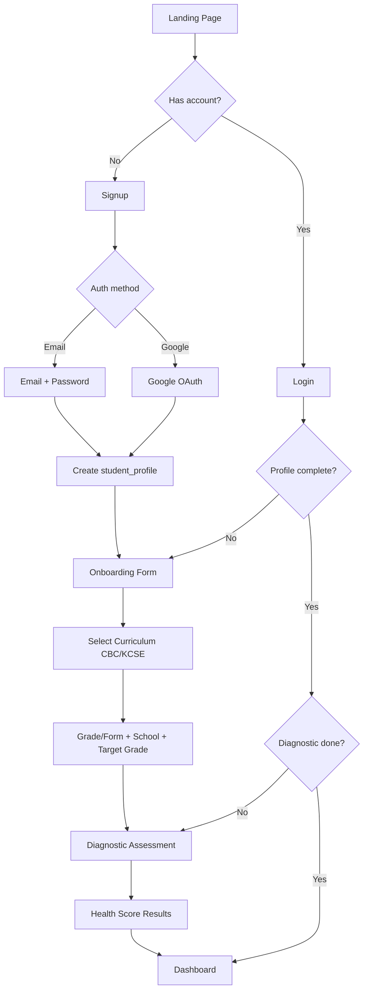
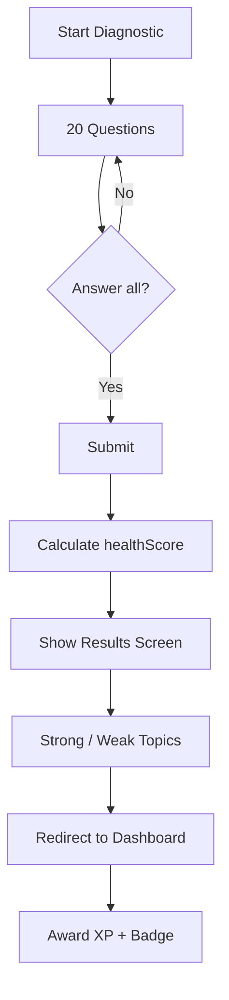
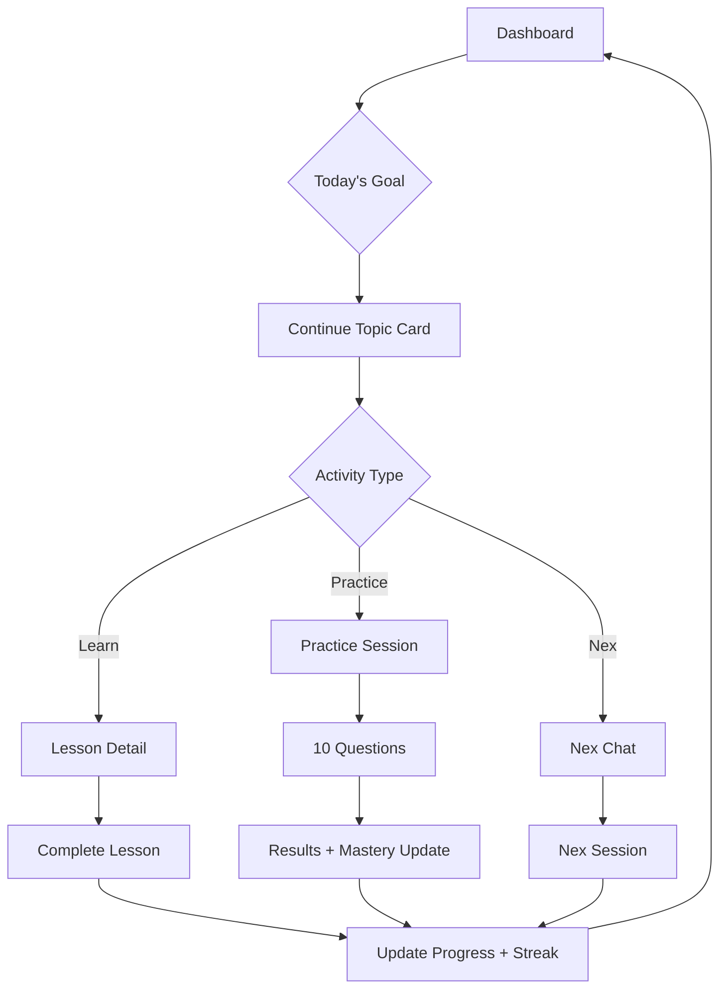
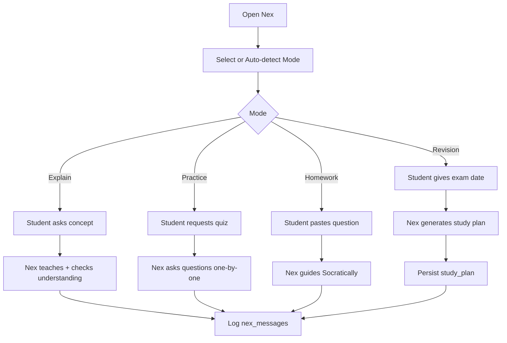
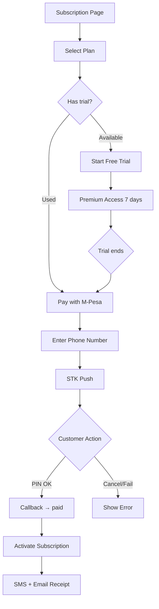
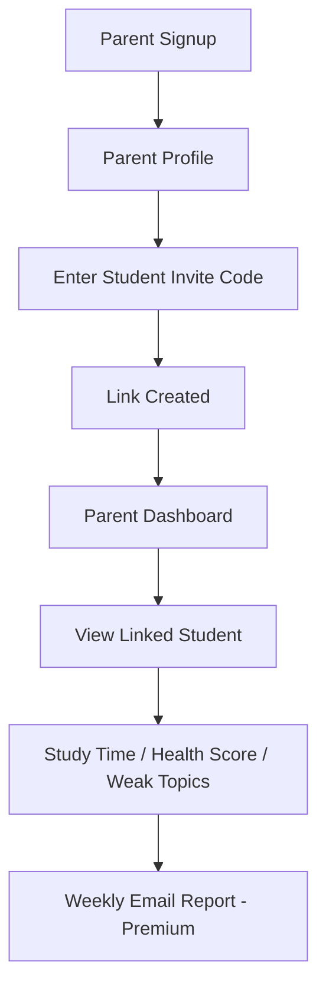

# User Flows

**Version:** 1.0

---

## 1. Core Student Journey (MVP)

```
Landing → Signup → Onboarding → Diagnostic → Health Score → Dashboard
    → Learn / Practice / Nex → Progress
```

---

## 2. Student Registration Flow



### Onboarding Fields

- Curriculum: CBC | KCSE
- Grade/Form
- School name
- Target grade (e.g., Math → A)

---

## 3. Diagnostic Flow



---

## 4. Daily Learning Flow



---

## 5. Nex Chat Flow



### Free Tier Gate

```
Send message → Check daily limit → If exceeded → Upgrade modal
```

---

## 6. Practice Flow

```
Select Topic → Select Difficulty → Start Session (10 Q)
    → Answer each → Submit
    → Score + Weak Areas + Mastery Update
    → Recommendation (Nex or next topic)
```

---

## 7. Subscription / M-Pesa Flow



---

## 8. Parent Flow



---

## 9. Error / Edge Flows

| Scenario | Flow |
|----------|------|
| Session expired | Redirect to `/login` with return URL |
| Diagnostic incomplete | Redirect to `/onboarding/diagnostic` |
| Nex rate limited | Show upgrade CTA, preserve message draft |
| M-Pesa timeout | Poll verify endpoint, show retry |
| Trial expired | Premium features blocked, upgrade prompt |
| No phone on file | SMS skipped, email fallback |

---

## 10. Student utility flows (post-MVP utilities)

| Utility | Route | Purpose |
|---------|-------|---------|
| Exam prep | `/exam-prep` | Generate KCSE-style mock practice materials |
| Mock exams | `/mock-exams` | Build and run generated mock exams |
| Exam simulator | `/exam-simulator` | Timed simulator sessions |
| Study search | `/study-search` | Search lessons and practice content |
| Mistake journal | `/mistakes` | Review missed questions |
| Focus mode | `/focus` | Timed study sessions |
| Weak areas | `/weak-areas` | Target low-mastery topics |
| Assignment help | `/assignment-help` | Nex-guided homework help |

---

## 11. Admin operational flows

| Workflow | Route | Purpose |
|----------|-------|---------|
| Reports export | `/admin/reports` | CSV export with audit trail |
| Communications | `/admin/communications` | Template library + operational send |
| Approvals / bulk actions | `/admin/approvals`, `/admin/bulk-actions` | Four-eyes bulk execution |
| Content review | `/admin/studio/review` | Publish gate for lessons/questions |
| Payments ops | `/admin/payments` | Ledger + operator tools |
| Platform settings | `/admin/platform-settings` | Live pricing/limits (60s cache) |

---

## 12. Acceptance Criteria (Flow-Level)

- [ ] New student completes full journey in <15 minutes
- [ ] Diagnostic blocks dashboard until complete
- [ ] M-Pesa payment activates premium without page refresh (polling)
- [ ] Parent sees linked student data within 1 minute of linking
- [ ] All flows work on 375px mobile viewport
