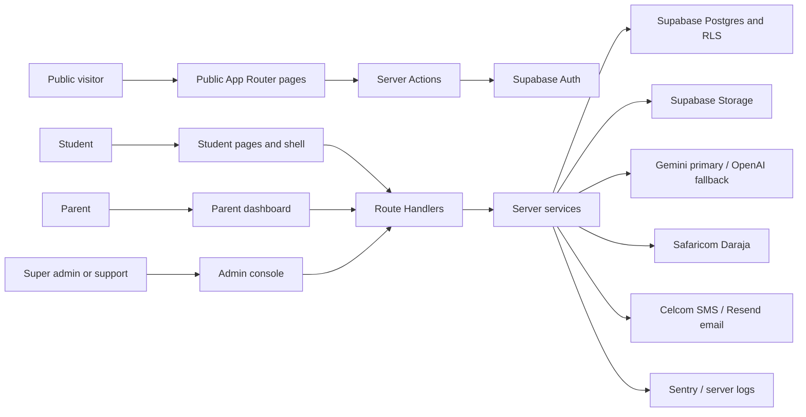

# Nexus System Map

> Repository-grounded product, journey, route, service, data, and production-readiness map.
>
> **Snapshot date:** 2026-06-29
>
> **Repository:** `C:\Users\gar\Desktop\Garnet Labs\nexus`
>
> **Framework:** Next.js 16.2.9 App Router, React 19.2.4, TypeScript, Supabase, Tailwind CSS 4
>
> **Audience:** developers, product/operations staff, QA, and coding agents

## 1. Purpose and authority

This file describes what the checked-out application actually exposes today. It is intended to be the first document read before changing Nexus.

Use this authority order when sources disagree:

1. Security, legal, and explicit current product decisions.
2. `AGENTS.md` and the active milestone status.
3. This map for implemented routes, journeys, dependencies, and known gaps.
4. Current code, migrations, and tests for exact behavior.
5. Older phase and V1 documents as design history, not necessarily current implementation truth.

The current documentation set contains material drift. For example, `docs/product-governance/mvp-feature-scope-lock.md` still calls camera, voice, mock exams, Science, English, Kiswahili, Chemistry, and offline mode V2/banned, while the active code and milestones expose most of those surfaces. Coding agents must not infer current scope solely from the old V1 lock.

### Maturity labels used here

| Label | Meaning |
|---|---|
| **Operational** | Real UI/API/data path exists and performs the core stated job. It may still have production risks. |
| **Partial** | Meaningful behavior exists, but the journey is incomplete, disconnected, or narrower than the UI wording suggests. |
| **Shell** | Primarily navigation, display, or record-keeping; the claimed underlying capability is not implemented. |
| **Redirect** | Compatibility route only; it forwards elsewhere. |
| **Internal** | Operator/developer surface, not a normal end-user journey. |

## 2. Repository snapshot

| Surface | Current count |
|---|---:|
| Page routes | 69 |
| Public pages | 6 |
| Student pages | 28 |
| Parent pages | 1 |
| Admin pages | 34 |
| API route files | 73 |
| SQL migrations | 39 |
| Database tables introduced by migrations | 79 |
| Unit/component/integration test files | 83 |
| Playwright E2E specs | 5 |

The active milestone is `v2-tier-1`, state `PHASE_2_5_CODE_COMPLETE`. Phase 2.5 Voice is code-complete but the milestone still calls for batch verification.

## 3. System architecture

### Layer map

| Layer | Main locations | Responsibility |
|---|---|---|
| Routes and layouts | `src/app/**` | Pages, route groups, loading/error boundaries, API entry points |
| Feature UI | `src/features/**` | Student, Nex, learning, practice, exam, pricing, parent, and admin components |
| Shared UI | `src/components/**` | Shells, navigation, charts, fields, buttons, cards, content rendering |
| Server Actions | `src/server/actions/**` | Auth, onboarding, profile mutation |
| Services | `src/server/services/**` | Business rules, privileged data access, orchestration, admin reads/mutations |
| Domain libraries | `src/lib/**` | Assessment, scoring, mastery, Nex prompting/model calls, M-Pesa, notifications |
| Validation | `src/schemas/**` | Zod request, form, content, and admin schemas |
| Persistence | `supabase/migrations/**`, `supabase/seed/**` | Schema, RLS, storage policies, seed content |
| Verification | `tests/**`, `e2e/**` | Unit, component, contract, RLS-string, golden conversation, and browser tests |

### Request and trust boundaries

- `src/proxy.ts` refreshes Supabase auth and gates the established student, parent, and admin route families.
- Page-level guards remain important. Several newer student routes are not named in the proxy matcher, but call `requireStudentExperience()` and redirect unauthenticated/incomplete users server-side.
- API routes do not pass through page authorization assumptions. Each handler must authenticate and authorize independently.
- Most user-facing writes identify the student from the authenticated session rather than trusting a client-supplied student ID.
- Many server services use the Supabase service-role client after a route/page guard. A missing guard therefore becomes a high-impact data boundary failure.
- RLS is enabled across all application tables. Service-role operations bypass it by design.

## 4. Roles and access model

| Role | Identity source | Primary destination | Effective access |
|---|---|---|---|
| Visitor | No session | `/` | Marketing, pricing display, About, signup/login, teacher waitlist |
| Student | `app_metadata.userRole = student` plus `student_profiles` | `/onboarding`, `/diagnostic`, then `/dashboard` | Learning, practice, Nex, exams, plans, progress, profile, billing/family tools |
| Parent | `app_metadata.userRole = parent` plus `parent_profiles` | `/parent` | Link students and read limited linked-student progress |
| Support | `app_metadata.userRole = support` | `/admin/platform-settings` redirect target, then guarded pages | Broad admin read access and selected workflow mutations; no Studio, settings, role assignment, comp grants, impersonation, rollouts, or profile correction |
| Super admin | `app_metadata.userRole = super_admin` | `/admin/platform-settings` | Full current admin and content-author access |

Important implementation truth:

- Runtime authorization reads `app_metadata.userRole` in `superAdminGuard.ts`.
- The Admin Roles page writes `admin_role_assignments`, but that table is not read by runtime guards and the write does not update Supabase Auth metadata. The page is therefore an assignment ledger, not a functioning permission-control system.
- Content authoring is super-admin-only through `requireContentAuthor()`.

## 5. End-to-end user journeys

### 5.1 Visitor discovery and conversion

1. Visitor enters `/`.
2. Landing content positions Nexus as an academic companion with diagnostic, personalized study, Nex tutoring, practice, and mock-exam messaging.
3. Visitor can open `/about`, `/pricing`, `/login`, `/signup`, or `/waitlist/teacher`.
4. Public pricing reads platform settings with fallback defaults. Anonymous visitors see plan comparison; authenticated students see checkout and trial controls.
5. Teacher waitlist submits to `/api/waitlist/teacher`, validates with Zod, checks duplicates, and stores a `teacher_waitlist` row.

Current limitations: no `robots.ts`, `sitemap.ts`, manifest, Open Graph image, canonical policy, or route-specific metadata strategy is present.

### 5.2 Student email signup and login

1. `/signup` defaults to student; `?role=parent` switches account type.
2. If `BETA_INVITE_REQUIRED=true`, signup validates a beta invite before Auth creation.
3. `signupAction` creates the Supabase Auth user, writes `app_metadata.userRole`, creates the profile, then consumes the invite.
4. A signed-in student is routed according to profile state: onboarding incomplete -> `/onboarding`; diagnostic incomplete -> `/diagnostic`; complete -> `/dashboard`.
5. `/login` signs in by password and uses the same post-auth routing.

Risk: signup/profile/invite consumption is not transactional. A race or late invite-consumption failure can leave a created account/profile while returning an error.

### 5.3 Google OAuth

1. Student or parent starts OAuth from signup when the beta gate is not shown.
2. Supabase redirects to `/auth/callback?role=...`.
3. Callback exchanges the code, preserves an existing role if present, otherwise applies the requested student/parent role.
4. Missing profiles are created, then the user is routed by role and onboarding state.

The beta invite requirement is enforced in the email signup action/UI, not independently in the OAuth callback.

### 5.4 Student onboarding and diagnostic gate

1. `/onboarding` collects curriculum (CBC/KCSE), grade/form, optional school, and target grade.
2. `completeOnboardingAction` validates and updates the authenticated profile.
3. `/diagnostic` loads available assessments, starts an attempt, renders one question at a time, submits all answers, calculates Academic Health Score and predicted grade, persists topic results, and unlocks the student app.
4. The proxy and core pages redirect diagnostic-incomplete users away from the main learning routes.

### 5.5 Daily student journey

1. `/dashboard` loads the student experience aggregate: progress, active plan, weekly summary, plan code, saved items, mistakes, weekly goal, focus sessions, offline-pack records, recent lessons/practice/mocks.
2. It recommends the next activity and links to tasks, weak areas, saved items, mistakes, readiness, Nex memory, offline packs, weekly goal, focus, and concept library.
3. Desktop navigation groups routes into Today, Study, Practice, Tools, and Me. Mobile navigation keeps Today, Learn, Tasks, Nex, and Practice visible.
4. Ctrl/Cmd-K opens a route/action palette.

Performance note: the student layout loads `getStudentChromeData()` and many pages separately load `getStudentExperienceData()`, duplicating auth/profile and multiple database reads on the same request.

### 5.6 Learn journey

1. `/learn` lists active, grade-visible subjects with published content coverage.
2. `/learn/[topicId]` shows ordered subtopics/lessons, completion state, topic mastery, estimated time, Practice, and Ask Nex actions.
3. `/learn/[topicId]/[lessonId]` renders structured lesson blocks: headings, rich text, worked examples, tips, callouts, images, tables, math, chemical equations, passages, video links, inline questions, attachments, dividers, and optional short quiz.
4. Viewing and completion call `/api/lessons/[id]/viewed` and `/complete`; completion contributes progress.
5. Lesson bookmarks are browser-local only. They do not populate the server-backed `/saved` page.

### 5.7 Practice journey

1. `/practice` loads a curriculum/subject/topic/subtopic tree and published question coverage.
2. Student chooses scope and difficulty; `/api/practice-sessions` enforces the daily plan limit and starts a session.
3. Answers go to `/api/practice-sessions/[id]/answer`; completion goes to `/complete`.
4. Results include score, explanations, topic breakdown, health snapshot, and actions to practise again or ask Nex.
5. Practice updates mastery, XP/streak, study activity, and the daily usage counter.
6. Missed-question review is stored in browser `localStorage`; it is separate from the database-backed Mistake Journal.

### 5.8 Nex text, camera, and voice journey

1. `/nex` restores the latest active conversation and supports Explain, Practice, Homework, and Revision UI modes. Assessment can be selected server-side by mode detection.
2. `/assignment-help` opens the same chat in Homework mode.
3. `/api/nex/chat` authenticates a student, checks plan/daily usage, loads curriculum and derived memory, assembles a prompt, calls Gemini with optional OpenAI fallback, validates/presents the response, persists messages and misconceptions, and streams when allowed.
4. Homework mode applies a judge/safety path intended to avoid revealing full answers too early.
5. Camera is available in Homework mode for eligible paid/family users. `/api/nex/camera` validates/uploads the image, extracts text, invokes the tutor, persists the session, and returns the response.
6. Voice is available to eligible paid/family users. `/api/nex/voice` transcribes audio, invokes the tutor, synthesizes speech, persists messages, and returns base64 audio.
7. `/nex-memory` summarizes profile, weak/recommended topic, and personalization signals; it is a readable projection, not a dedicated editable memory store.

### 5.9 Exams and readiness

1. `/exam-prep` provides a wizard for subject, duration, question count, and timed exam creation.
2. Generation uses the published practice bank through `/api/mock-exams/generate`; it is not a licensed past-paper archive.
3. `/api/exam-simulator/start` starts a timed simulator session.
4. `/exam-simulator?sessionId=...` loads the student-owned session, renders navigation/timer/answers, and submits to `/api/exam-simulator/[id]/submit`.
5. Results show score, predicted grade, mistakes, topic breakdown, and routes back to progress/practice.
6. `/mock-exams` is a compatibility redirect to `/exam-prep`.
7. `/readiness` summarizes the latest mock and recommended topic, but its Mock Exam and bare Exam Simulator links ultimately redirect through Exam Prep unless a session exists.

### 5.10 Study plans, tasks, progress, and revision

- `/study-plan` reads/generates daily plans for all students and 14-day exam plans for Premium/trial students.
- `/tasks` projects active study-plan tasks and links each to Practice.
- Task completion is persisted through `/api/study-plans/tasks/[id]` after ownership verification.
- `/progress` shows Academic Health Score history, predicted grade, mastery, XP/level, streak, badges, weekly summary, and weakest-topic actions.
- `/revision` is a dedicated KCSE Mathematics revision hub with readiness, repair topics, and revision actions.
- `/continue` aggregates the recommended action, recent lessons, and recent practice.
- `/weak-areas` sorts topic mastery below 70% and links directly to practice.

### 5.11 Student tools and their real maturity

| Tool | Current behavior | Maturity |
|---|---|---|
| Study Search | Ctrl-K searches a static route/action list; `/study-search` aggregates weak areas, saved items, and recent lessons. It does not query lesson/question text. | Partial |
| Saved Questions | Supports server-backed quick notes and renders `student_saved_items`. Lesson bookmark and practice question flows do not write here. | Partial |
| Mistake Journal | Renders/updates `student_mistake_journal`; no practice/mock code currently inserts rows into it. | Shell/Partial |
| Weekly Goal | Persists minutes/tasks/note and `parent_visible`. Parent dashboard does not currently read or show it. | Partial |
| Focus Sessions | Creates a planned-duration record and lets the student manually mark complete/cancel. No countdown/timer or elapsed-time verification exists. | Shell |
| Offline Packs | Writes an `offline_packs` row with status `downloaded`; no payload generation, cache, service worker, or download occurs. | Shell |
| Concept Library | Four static category cards that all link to `/learn`; no formula/reference library exists. | Shell |
| Learning Memory | Read-only summary derived from profile/progress, not a memory-management surface. | Partial |

### 5.12 Profile, trial, payment, and family journey

1. `/profile` shows account details, plan, daily Nex/practice usage, editable profile/preferences, parent invite code, family membership, and join-family form.
2. `/pricing` for a student offers a once-per-student 7-day Premium trial and M-Pesa checkout.
3. Trial starts through `/api/subscriptions/trial`.
4. Checkout resolves the selected plan and live configured amount, writes a pending payment, requests Daraja STK push, then waits for `/api/mpesa/callback` to activate the subscription.
5. A Family owner receives an invite code; another student joins through `/api/family/join` and receives an active Family subscription.

This journey is not safe for real money yet; see the P0 findings.

### 5.13 Parent journey

1. Parent signs up separately or uses Google OAuth with `role=parent`.
2. `/parent` allows entry of a student-generated invite code.
3. `/api/parents/link` validates the parent session, links the student, and sends the configured success notification.
4. Parent sees each linked student's curriculum/grade, seven-day study minutes, health score, weak topics, KCSE Mathematics readiness/repair topic, and a tutor-chat privacy note.
5. Weekly reports are generated by the protected cron route and can use SMS/email adapters.

Current gaps: there is no unlink/revoke UI, no parent profile/settings page, no notification preferences, and no display of the student's `parent_visible` weekly goal.

### 5.14 Admin operations journey

1. Super admin/support enters the admin shell and command center.
2. Dashboard aggregates lifecycle, intervention, content, Nex safety, support, revenue, and rollout summaries.
3. Users can be searched; detail pages aggregate profile, subscriptions, parents, usage, health, payments, support cases, entitlements, and a timeline.
4. Super admin can correct curriculum/grade/target grade, grant comp access, and start an audited view-as-student session.
5. Operational surfaces cover alerts, approvals, support cases, communications metadata, experiments, saved views, reports, payments/coupons, outcomes, Nex flags, usage/cost, beta invites, assessment calibration, platform settings, and content.
6. The Authoring Studio browses curriculum, creates/edits block-based lessons, manages question banks, invokes AI assistance, submits review, applies quality gates, publishes, archives, and restores lesson versions.

Important truth: several admin modules are control-plane ledgers, not execution engines. Approving a bulk action does not execute it; feature rollout rows are not consumed by student feature gates; role assignment rows do not change Auth roles; report cards do not export CSV; communication templates do not constitute a campaign sender.

## 6. Complete page inventory

### 6.1 Public pages

| Route | Purpose | Access | Maturity |
|---|---|---|---|
| `/` | Marketing landing page | Public | Operational |
| `/about` | Mission/product narrative | Public | Operational |
| `/pricing` | Anonymous plan comparison or authenticated student checkout | Public/student | Operational with payment blockers |
| `/waitlist/teacher` | Teacher-interest form | Public | Operational with rate-limit caveat |
| `/login` | Password login; role query controls parent links | Public | Operational |
| `/signup` | Student/parent signup and optional beta invite | Public | Operational with consistency caveats |
| `/auth/callback` | Google OAuth exchange/profile bootstrap | OAuth callback | Operational |

### 6.2 Student pages

| Route | Purpose | Maturity |
|---|---|---|
| `/onboarding` | Curriculum, grade, school, target grade | Operational |
| `/diagnostic` | Required diagnostic assessment | Operational |
| `/dashboard` | Personalized daily command center | Operational |
| `/continue` | Resume recommendation/recent study | Operational |
| `/tasks` | Current plan tasks | Operational |
| `/learn` | Subject/topic explorer | Operational, content-dependent |
| `/learn/[topicId]` | Topic/subtopic/lesson path | Operational, content-dependent |
| `/learn/[topicId]/[lessonId]` | Lesson reader and short quiz | Operational |
| `/study-search` | Personal shortcut aggregation | Partial |
| `/library` | Concept-category links | Shell |
| `/study-plan` | Daily and Premium exam plans | Operational |
| `/weekly-goal` | Student-set weekly target | Partial |
| `/practice` | Practice selection, runner, and results | Operational |
| `/revision` | KCSE Mathematics revision hub | Operational, math-specific |
| `/weak-areas` | Low-mastery topic queue | Operational |
| `/mistakes` | Database-backed mistake states | Partial/disconnected |
| `/readiness` | Latest mock/readiness summary | Partial |
| `/mock-exams` | Redirects to `/exam-prep` | Redirect |
| `/exam-prep` | Mock generation/setup wizard | Operational |
| `/exam-simulator` | Timed session and review | Operational with valid `sessionId` |
| `/nex` | Main Nex chat | Operational with provider/config risks |
| `/assignment-help` | Nex Homework-mode entry | Operational |
| `/nex-memory` | Personalization summary | Partial |
| `/saved` | Saved items/quick notes | Partial |
| `/focus` | Focus-session records | Shell |
| `/offline` | Offline-pack records | Shell |
| `/progress` | Health/mastery/XP/streak/badges/weekly data | Operational |
| `/profile` | Account, preferences, usage, plan, family | Operational |

### 6.3 Parent page

| Route | Purpose | Access | Maturity |
|---|---|---|---|
| `/parent` | Link students and view limited progress/readiness | Parent | Operational but narrow |

### 6.4 Admin pages

| Route | Purpose | Page guard | Maturity |
|---|---|---|---|
| `/admin` | Command center | Support + super admin | Operational |
| `/admin/inbox` | Cross-module task queue | Support + super admin | Operational |
| `/admin/search` | Admin pages/record index | Support + super admin | Partial search |
| `/admin/reports` | Report entry links | Support + super admin | Shell; no export |
| `/admin/users` | Student/parent directory | Support + super admin | Operational |
| `/admin/users/[id]` | Student 360/account operations | Support + super admin; mutations separately restricted | Operational |
| `/admin/users/[id]/view` | Audited view-as-student dashboard | Super admin | Operational |
| `/admin/roles` | Role assignment ledger | Super admin | Shell; not runtime authorization |
| `/admin/support` | Internal support cases | Support + super admin | Operational |
| `/admin/communications` | Template/log records | Support + super admin | Partial; no campaign sender |
| `/admin/studio` | Content workspace | Super admin/content author | Operational |
| `/admin/studio/new` | Create manual lesson draft | Super admin/content author | Operational |
| `/admin/studio/[lessonId]` | Block editor/AI assist/versions | Super admin/content author | Operational |
| `/admin/studio/review` | Review/publish queue | Super admin/content author | Operational |
| `/admin/content` | Legacy redirect to Studio | Proxy + redirect | Redirect |
| `/admin/content-calendar` | Review queue presented as weekly calendar | Support + super admin | Partial |
| `/admin/assessment` | KCSE calibration intake | Super admin | Operational/internal |
| `/admin/ai-quality` | Nex flags/quality summary | Support + super admin | Operational |
| `/admin/outcomes` | Cohorts and at-risk students; parent SMS action | Support + super admin; SMS super admin | Operational |
| `/admin/payments` | Payment ledger/funnel/coupons | Support + super admin; coupon writes super admin | Operational |
| `/admin/revenue-ops` | Failed payments/coupon capacity | Support + super admin | Operational/read-only |
| `/admin/campaigns` | Beta invite/coupon performance | Super admin | Operational/read-only |
| `/admin/beta-invites` | Private beta invite generation | Super admin | Operational |
| `/admin/experiments` | Experiment records | Support + super admin | Ledger only |
| `/admin/rollouts` | Feature rollout records | Super admin | Shell; not enforced by product |
| `/admin/alerts` | Create/acknowledge/resolve alerts | Support + super admin | Operational |
| `/admin/bulk-actions` | Registry plus approval requests | Support + super admin | Shell; no executor |
| `/admin/approvals` | Approval request states | Support + super admin | Ledger only |
| `/admin/saved-views` | Saved route/filter records | Support + super admin | Partial |
| `/admin/health` | Derived operational summary | Support + super admin | Partial/misleading health checks |
| `/admin/usage-stats` | Nex cost/usage and raw flagged review | **Proxy only; support is admitted** | Authorization defect |
| `/admin/nex-ops` | Nex usage, cost, modes, top students, flags | Support + super admin | Operational |
| `/admin/platform-settings` | Pricing, limits, promotions, content auto-approve | Super admin | Operational |
| `/admin/audit-log` | Privileged action history | Support + super admin | Operational but audit writes fail open |

## 7. Complete API inventory

### 7.1 Student learning and account APIs

| Endpoint | Methods | Access | Purpose |
|---|---|---|---|
| `/api/diagnostic-assessments` | GET | Student profile | List diagnostic assessments/completion |
| `/api/diagnostic-assessments/[id]/start` | POST | Student profile | Start/reuse diagnostic attempt and return questions |
| `/api/diagnostic-assessments/[id]/submit` | POST | Student profile | Score diagnostic and persist health/mastery |
| `/api/lessons/[id]/viewed` | POST | Student profile | Mark lesson in progress/viewed |
| `/api/lessons/[id]/complete` | POST | Student profile | Complete lesson and award activity effects |
| `/api/practice-sessions` | POST | Student profile | Enforce daily cap and start practice |
| `/api/practice-sessions/[id]/answer` | POST | Student profile | Persist/score one answer |
| `/api/practice-sessions/[id]/complete` | POST | Student profile | Finalize results/mastery/XP/streak |
| `/api/study-plans` | GET, POST | Student profile | Read or generate daily/exam plan |
| `/api/study-plans/tasks/[id]` | PATCH | Student profile + ownership | Toggle task completion |
| `/api/mock-exams/generate` | POST | Authenticated student | Generate mock session from practice bank |
| `/api/mock-exams/[id]/submit` | POST | Authenticated student + ownership | Submit non-simulator mock |
| `/api/exam-simulator/start` | POST | Authenticated student | Start timed simulator session |
| `/api/exam-simulator/[id]/submit` | POST | Authenticated student + ownership | Submit/score simulator |
| `/api/nex/chat` | POST | Authenticated student | Text tutor, streaming, persistence, limits, misconceptions |
| `/api/nex/camera` | POST | Authenticated eligible student | Image upload/extraction/tutor response |
| `/api/nex/voice` | POST | Authenticated eligible student | Transcription/tutor/TTS response |
| `/api/students/saved-items` | GET, POST, DELETE | Student profile | List/create/delete saved item |
| `/api/students/mistakes` | GET, POST, PATCH | Student profile | List/create/update mistake journal |
| `/api/students/weekly-goal` | GET, POST | Student profile | Read/upsert current weekly goal |
| `/api/students/focus-sessions` | GET, POST, PATCH | Student profile | Record/list/update focus sessions |
| `/api/students/offline-packs` | GET, POST, PATCH | Student profile | Record/list/update pack metadata only |
| `/api/students/invite-code` | GET | Authenticated student | Get/generate parent-link invite code |
| `/api/subscriptions/trial` | POST | Authenticated student | Start once-only Premium trial |
| `/api/mpesa/stk-push` | POST | Authenticated student | Initiate payment and create payment record |
| `/api/family/invite-code` | GET | Family-plan owner student | Get family invite code |
| `/api/family/join` | POST | Authenticated student | Join family group by code |
| `/api/parents/link` | POST | Authenticated parent | Link student and notify |

### 7.2 Public, webhook, and scheduled APIs

| Endpoint | Methods | Access | Purpose |
|---|---|---|---|
| `/api/waitlist/teacher` | POST | Public | Store teacher waitlist entry |
| `/api/mpesa/callback` | POST | **Public/unverified** | Update payment and activate subscription |
| `/api/celcom/webhook` | POST | **Public/unverified** | Update SMS delivery report |
| `/api/cron/weekly-reports` | GET, POST | Bearer `CRON_SECRET` | Generate/send linked-student weekly reports |

### 7.3 Admin APIs

| Endpoint | Methods | Access | Purpose |
|---|---|---|---|
| `/api/admin/users` | GET | Support + super admin | User directory |
| `/api/admin/users/[id]/profile` | PATCH | Super admin | Correct student academic profile |
| `/api/admin/users/[id]/comp` | POST | Super admin | Grant comp subscription |
| `/api/admin/users/[id]/impersonate` | POST, DELETE | Super admin | Start/end view-as-student session |
| `/api/admin/audit-log` | GET | Support + super admin | Filtered audit log |
| `/api/admin/beta-invites` | GET, POST | Super admin | List/create beta invites |
| `/api/admin/platform-settings` | PATCH | Super admin | Update pricing, limits, promotions, content auto-approve |
| `/api/admin/assessment/calibrations` | POST | Super admin | Ingest KCSE calibration data |
| `/api/admin/payments` | GET | Support + super admin | Payment dashboard |
| `/api/admin/payments/coupons` | GET; POST | Read both; write super admin | List/create coupons |
| `/api/admin/payments/coupons/[id]` | PATCH, DELETE | Super admin | Deactivate coupon (both methods map to deactivation) |
| `/api/admin/outcomes` | GET | Support + super admin | Outcomes/cohort/at-risk data |
| `/api/admin/outcomes/parent-sms` | POST | Super admin | Send parent intervention SMS |
| `/api/admin/nex-ops` | GET | Support + super admin | Nex operational dashboard |
| `/api/admin/nex-ops/flags` | GET; POST | Read both; write super admin | List/create flags |
| `/api/admin/nex-ops/flags/[id]` | PATCH | Super admin | Resolve/escalate flag |
| `/api/admin/usage-stats` | GET, PATCH | Super admin | Cost snapshot and review status |
| `/api/admin/support-cases` | GET, POST, PATCH | Support + super admin | Support case workflow |
| `/api/admin/feature-rollouts` | GET, POST | Super admin | Store rollout definitions |
| `/api/admin/alerts` | GET, POST, PATCH | Support + super admin | Alert workflow |
| `/api/admin/approvals` | GET, POST, PATCH | Support + super admin | Approval ledger |
| `/api/admin/communications` | GET, POST | Support + super admin | Template/log records |
| `/api/admin/experiments` | GET, POST | Support + super admin | Experiment ledger |
| `/api/admin/saved-views` | GET, POST | Support + super admin | Saved view records |
| `/api/admin/roles` | GET, POST | Super admin | Role-assignment records, not Auth mutation |
| `/api/admin/content/assist` | POST | Content author | Non-persisting AI draft/expand/simplify/rewrite/questions |
| `/api/admin/content/media/upload` | POST | Content author | Upload content media |
| `/api/admin/content/drafts/lesson/create` | POST | Content author | Create manual draft lesson |
| `/api/admin/content/drafts/lesson` | PATCH | Content author | Update draft lesson |
| `/api/admin/content/drafts/lesson/[id]` | GET | Content author | Load draft preview/editor data |
| `/api/admin/content/studio/subtopics/[subtopicId]/lessons` | GET | Content author | List subtopic lessons |
| `/api/admin/content/studio/subtopics/[subtopicId]/lessons/reorder` | PATCH | Content author | Reorder lessons |
| `/api/admin/content/studio/topics/[topicId]/questions` | GET | Content author | List question bank |
| `/api/admin/content/studio/topics/[topicId]/questions/bulk` | PATCH | Content author | Bulk create/update/archive questions |
| `/api/admin/content/review/queue` | GET | Content author | Load in-review content |
| `/api/admin/content/review/submit` | POST | Content author | Run gates and submit/auto-publish |
| `/api/admin/content/review/approve` | POST | Content author | Publish after gates |
| `/api/admin/content/review/request-changes` | POST | Content author | Return item to draft |
| `/api/admin/content/review/archive` | POST | Content author | Archive draft/in-review item |
| `/api/admin/content/review/lessons/[lessonId]/versions` | GET | Content author | List published versions |
| `/api/admin/content/review/lessons/[lessonId]/versions/restore` | POST | Content author | Restore version into a draft |

## 8. Feature/module ownership map

| Module | UI entry points | Main services/libraries | Primary tables | State |
|---|---|---|---|---|
| Auth/onboarding | `/login`, `/signup`, `/auth/callback`, `/onboarding` | `authActions`, `authService`, `onboardingActions`, proxy | Auth users, `student_profiles`, `parent_profiles`, `beta_invites` | Operational |
| Diagnostic/health | `/diagnostic`, `/progress`, admin assessment | `diagnosticService`, scoring/health/KCSE assessment engines | `diagnostic_*`, `academic_health_scores` | Operational |
| Curriculum/Learn | `/learn/**`, Studio | `curriculumService`, lesson progress/content model | `curricula`, `grade_levels`, `subjects`, `topics`, `subtopics`, `lessons`, `lesson_progress` | Operational; content-dependent |
| Practice/mastery | `/practice`, `/weak-areas`, `/mistakes` | `practiceService`, mastery engine, local review queue | `practice_*`, `topic_mastery`, `student_progress`, mistake journal | Core operational; journal disconnected |
| Nex | `/nex`, `/assignment-help`, `/nex-memory` | prompt assembly, model calls, validation, history, usage, misconceptions | `nex_sessions`, `nex_messages`, `nex_daily_usage`, recommendations/flags | Operational with P0 config/counter risks |
| Camera/voice | Nex Homework UI | camera/voice routes, extraction/transcription/TTS | `nex_messages`, private `nex-uploads` storage | Operational with provider/mock risks |
| Mock exams | `/exam-prep`, `/exam-simulator`, `/readiness` | `mockExamService`, mock/simulator engines | `mock_exam_*`, `exam_simulator_sessions` | Operational; not past-paper bank |
| Study plan | `/study-plan`, `/tasks`, dashboard | `studyPlanService`, study-plan engine | `study_plans`, `study_tasks`, `daily_goals` | Operational |
| Progress/gamification | `/progress`, dashboard | practice/diagnostic/weekly report services, gamification | mastery, progress, XP, streaks, badges, study logs | Operational |
| Student utility suite | Continue/Search/Saved/Weekly/Focus/Offline/Library | `studentExperienceService` and components | new student experience tables | Mixed; several shells |
| Parent/family | `/parent`, Profile family controls | `parentLinkService`, `familySubscriptionService`, reports | links, family groups/members, reports | Operational with atomicity/UI gaps |
| Billing | `/pricing`, Profile, Payments admin | subscription service, M-Pesa client | plans, subscriptions, trials, payments/callbacks/events/invoices | **Not production-ready** |
| Notifications | Parent link, payment, weekly cron, outcomes | notification service, Celcom/Resend clients | templates/logs/reports | Not production-ready |
| Content Studio | `/admin/studio/**` | Studio, generation, assist, quality, approval services | lessons/questions/jobs/versions/media | Operational internal workflow |
| Admin control plane | `/admin/**` | admin ops/platform/read services | audit, cases, flags, coupons, rollouts, alerts, roles, templates, experiments, views, approvals | Mixed; real reads plus non-enforced ledgers |

## 9. Data model map

### Identity and relationships

- `student_profiles`, `parent_profiles`, `super_admin_profiles`: application profiles tied to Supabase Auth users.
- `student_parent_links`: invite-based parent/student relationship and status.
- `family_groups`, `family_group_members`: paid family ownership, invite code, seats, and members.

### Curriculum and published content

- `curricula`, `grade_levels`, `subjects`, `topics`, `subtopics`: curriculum hierarchy.
- `lessons`: structured block JSON, grade visibility, review state, author/publisher fields.
- `practice_questions`: question bank, difficulty/options/answer/explanation, review state.
- `lesson_progress`: per-student viewed/completed state.
- `lesson_versions`: publish snapshots for restore/history.
- `content_generation_jobs`: background/script generation job records.
- `kcse_paper_calibrations`: KCSE blueprint/calibration input.

### Diagnostics, practice, mastery, and gamification

- `diagnostic_assessments`, `diagnostic_questions`, `diagnostic_attempts`, `diagnostic_results`.
- `academic_health_scores`: score/predicted-grade history.
- `practice_sessions`, `practice_attempts`, `practice_results`.
- `student_progress`, `topic_mastery`, `study_time_logs`.
- `student_streaks`, `student_xp`, `student_badges`.

### Study planning and student tools

- `study_plans`, `study_tasks`, `daily_goals`.
- `student_saved_items`, `student_mistake_journal`, `student_weekly_goals`, `student_focus_sessions`, `student_offline_packs`.

### Nex and exam data

- `nex_sessions`, `nex_messages`, `nex_recommendations`, `nex_daily_usage`, `nex_message_flags`.
- `mock_exam_sessions`, `mock_exam_questions`, `mock_exam_results`, `exam_simulator_sessions`.

### Billing and subscription

- `subscription_plans`, `student_subscriptions`, `subscription_trials`.
- `mpesa_payments`, `mpesa_callbacks`, `payment_transactions`, `billing_events`, `invoices`.
- `coupons`, `admin_subscription_grants`.

### Notifications and parent reporting

- `sms_templates`, `celcom_sms_logs`, `email_templates`, `resend_email_logs`.
- `parent_reports`, `weekly_reports`.

### Platform administration

- `platform_settings`, `platform_settings_audit_log`, `beta_invites`, `teacher_waitlist`.
- `admin_audit_log`, `admin_impersonation_sessions`, `admin_support_cases`, `admin_feature_rollouts`.
- `admin_alerts`, `admin_role_assignments`, `admin_communication_templates`, `admin_communication_logs`.
- `admin_experiments`, `admin_saved_views`, `admin_approval_requests`.

### RLS and privileged access

- All application tables have RLS enabled in migrations.
- Students can read/update their own allowed records; parents receive specific linked-student read policies.
- Curriculum content is authenticated-readable when `is_active=true`; application services also filter published/active content.
- Admin-only operational tables generally have no authenticated policies and are accessed with the service-role client after server authorization.
- Storage buckets: `nex-uploads` is private/student-scoped; content media is publicly readable with super-admin mutation policies.

## 10. External integrations and configuration

| Integration | Purpose | Required server configuration | Current fallback behavior |
|---|---|---|---|
| Supabase | Auth, Postgres, Storage, RLS | public URL/anon key/service-role key | No meaningful app without it |
| Gemini | Primary Nex text, vision, optional speech | `GEMINI_API_KEY` and model overrides | Text/image/voice can return mock output |
| OpenAI | Nex fallback, judge, Whisper/TTS fallback | `OPENAI_API_KEY` | Optional; mock if neither AI provider exists |
| M-Pesa Daraja | STK push/payment callback | consumer key/secret, passkey, shortcode, callback URL/env | Missing config creates and activates a mock paid subscription |
| Celcom | SMS | partner ID/API key/shortcode | Missing config or `NOTIFICATIONS_MOCK=true` records mock delivery |
| Resend | Email | API key/from email | Missing config or mock flag records mock delivery |
| Vercel Cron | Weekly parent reports | `CRON_SECRET` | Route rejects when secret missing/mismatched |
| Sentry | Server/client error monitoring | server/public DSNs | Disabled when DSNs absent |

Platform settings are cached for roughly 60 seconds and control plan prices, daily limits, family seats, promotion display/price, and content auto-approval. The application does not currently perform a production boot-time environment validation.

## 11. Testing, CI, and deployment truth

### Verified on 2026-06-29

| Gate | Result | Evidence |
|---|---|---|
| `npm run orchestrator:status` | PASS | Active milestone printed successfully |
| `npm run lint` | PASS with 4 warnings | No errors; unused symbols in scripts/test |
| `npm test` | PASS before concurrent F4 B2 edit | 82 files, 447 tests; current focused content suite now fails as noted below |
| `npm run test:scope-check` | PASS | Scope guard passed |
| `npm run build` | PASS | Next 16 production build emitted all routes |
| `npm run typecheck` | **FAIL** | ES2018 regex `s` flag used while TS target is ES2017 |
| `npm audit --audit-level=moderate` | **FAIL** | 1 high (`undici`) and 2 moderate (`postcss` chain) |
| `npx supabase migration list --linked` | PASS through F4 B1 | Local/remote matched through `20260625230000` when checked |
| Focused current content test | **FAIL** | Test references missing `20260625240000_kcse_math_f4_b2.sql` |

The CI workflow runs lint, standalone typecheck, tests, scope check, build, non-blocking linked DB lint, and Playwright. The repository is not CI-green: standalone typecheck fails, and a concurrent F4 B2 test edit currently references a missing migration file. The recorded production build passed before that edit.

### Coverage strengths

- Scoring, mastery, KCSE assessment/calibration, mock/simulator engines.
- Nex mode detection, prompt/model contracts, stream handling, presentation, golden conversations.
- Practice services/routes/components and coverage predicates.
- Content schemas, generation scope, Studio routes, review workflow, and audit contracts.
- Admin role guards, privileged mutation contracts, UI components, and service summaries.
- RLS policy presence tests for parent/mock surfaces.

### Coverage gaps

- E2E is mostly public smoke plus optional student credentials; parent and admin journeys lack real browser coverage.
- No real-provider staging E2E for Gemini/OpenAI, M-Pesa, Celcom, or Resend.
- No concurrency tests for daily counters, callbacks, invite consumption, or family seats.
- Several RLS tests inspect migration text rather than executing against a reset database.
- No E2E for the new student utility suite or Authoring Studio.
- No performance budget/Lighthouse/Web Vitals/3G verification.

## 12. Production-readiness verdict

**Verdict: not production-ready for paid or externally messaged launch.**

The learning core is a credible pre-release system: the recorded production build passed, the last full run before a concurrent content edit passed 447 tests, and the main student journeys are implemented. The current F4 B2 focused suite fails because its referenced migration file is absent. The blockers are concentrated in money trust, provider fail-closed behavior, authorization consistency, concurrency, misleading shell features/control surfaces, CI, and release hardening.

### P0 — must fix before any paid/public production launch

#### P0.1 Any caller can forge a successful M-Pesa callback

`/api/mpesa/callback` accepts unauthenticated JSON. If a payload contains a known `checkoutRequestId`, result code `0`, and receipt, the route marks the payment paid and activates the subscription. The checkout request ID is returned to the initiating student by `/api/mpesa/stk-push`, so a user can initiate a payment and forge success without paying.

Required correction: implement a provider-supported callback trust strategy (verified callback channel/signature/secret and strict replay controls), never treat checkout ID as proof, and add forged/replayed callback tests.

#### P0.2 Missing M-Pesa configuration grants paid access

When Daraja credentials are missing, the client returns `isMock=true`; the STK route marks the payment paid, activates the subscription, and sends success notifications. There is no production-only fail-closed guard.

Required correction: mock payment must be impossible in production, and production environment validation must fail deployment/startup when paid checkout is enabled without complete credentials.

#### P0.3 AI and notification providers also silently mock

Text, camera, voice, Celcom, and Resend can return/record mock success when keys are absent. A misconfigured production deployment can appear healthy while tutoring, OCR, speech, SMS, and email are fake.

Required correction: central environment preflight; explicit environment policy; mocks allowed only in tests/local development; admin health must display provider configuration truth.

### P1 — high-priority release blockers

#### P1.1 Standalone typecheck and CI fail

`tsconfig.json` targets ES2017, while `tests/content/kcseMathSeedContent.test.ts` uses dotAll regex flags at lines 68 and 115. The same test currently references an absent `20260625240000_kcse_math_f4_b2.sql` file. Standalone typecheck fails, and the focused suite fails during import even though the recorded Next build completed before this concurrent edit.

#### P1.2 Support can load the super-admin Usage Stats page data

The proxy admits support users to `/admin/**`. Most sensitive pages add an explicit role guard, but `/admin/usage-stats/page.tsx` directly calls the service-role-backed `loadNexOpsSnapshot()` without one. The API is super-admin-only, but server rendering bypasses that API and can expose flagged message content/cost data to support.

#### P1.3 Daily limits and family seats are race-prone

Nex/practice usage uses read-then-update/insert. Family join reads seat count, inserts membership, then updates the count. Parallel requests can exceed limits/seats or collide on inserts. Move these to transactional/atomic Postgres functions with constrained updates/row locks.

#### P1.4 Dependency audit is not clean

Current audit reports one high-severity `undici` advisory group and moderate PostCSS advisories through Next. Resolve safe updates or document a reviewed exception; do not use the suggested forced downgrade of Next.

#### P1.5 Baseline browser security and public SEO configuration are absent

`next.config.ts` has no security headers. There is no CSP/frame policy, `X-Content-Type-Options`, Referrer Policy, or Permissions Policy. Public discovery also lacks robots, sitemap, canonical/Open Graph route metadata, and manifest assets.

#### P1.6 Admin role and rollout controls do not control runtime behavior

- Role assignment writes only `admin_role_assignments`; runtime authorization reads Auth `app_metadata`.
- Rollout definitions are stored/read by admin summaries but no student/feature gate consumes them.
- Entitlement debugging hardcodes `featureEnabled: true`.

These surfaces can tell operators a role/rollout changed when the product did not change.

#### P1.7 Audit logging is fail-open

`recordAdminAudit()` catches every insertion failure so privileged mutations continue without an audit record. That conflicts with the product's use of audit history as a safety boundary. Decide which actions must fail closed or use a durable outbox/transaction.

#### P1.8 Several accessible features overstate implementation

Offline Packs, Focus Sessions, Concept Library, Mistake Journal integration, Saved Questions integration, Weekly Goal parent sharing, and Study Search are visible navigation destinations but do not deliver the full named capability. Either complete them, relabel them honestly, or hide them behind a real enforced rollout.

#### P1.9 Content `PROD_READY` labeling uses a start threshold

The content model declares 21 minimum practice questions per topic, while `isTopicPracticeReady()` labels practice ready when any one difficulty has only the five questions required to start a session. `getTopicReadinessLabel()` can therefore report `PROD_READY` far below the stated production coverage target.

#### P1.10 Admin System Health can provide false reassurance

The health page derives status from database summaries and hardcodes “Supabase data” healthy once the service executes. Missing Nex activity can look healthy, and it does not actively verify external AI, M-Pesa, SMS, email, cron, migration, latency, or queue health.

#### P1.11 Public rate limiting is process-local

Teacher waitlist uses an in-memory `Map`. It resets across serverless instances/deployments, is inconsistent across concurrent instances, and has no cleanup for old keys. Payment and AI endpoints also lack a durable burst/rate-limiting layer beyond non-atomic daily counters.

#### P1.12 Documentation and scope governance conflict with the app

The old V1 lock says several live routes are banned and claims Next.js 15. Screen inventories and user flows omit most current student/admin pages. This is dangerous for coding agents because following the wrong authority can remove live features or reject intended work.

### P2 — important hardening and product-quality work

- Make signup + invite consumption recoverable/transactional and make OAuth obey the beta policy independently.
- Add uniqueness/atomic idempotency for callback processing; current callback dedupe is check-then-insert.
- Verify notification log retention and privacy handling for email, phone, message body, Nex messages, uploads, and admin view-as data.
- Add unlink/revoke, parent settings, weekly-goal display, and notification preferences.
- Replace static/bare route links in Readiness with session-aware exam calls to action.
- Reduce duplicate student-shell/page aggregates and add query/latency instrumentation.
- Add real search indexing or narrow the wording of Study Search.
- Connect lesson bookmarks and missed practice/mock questions to the server-backed Saved/Mistake surfaces.
- Implement real offline artifact generation, caching, expiry, storage, and integrity—or remove the Offline label.
- Turn approval/bulk/communications/report/experiment surfaces into executable workflows only when a concrete operator contract exists.
- Add route-specific error states for public/admin flows and improve user-facing recovery for provider failures.
- Add admin bootstrap/demotion/break-glass, payment reconciliation, webhook replay, provider outage, and incident runbooks.

## 13. Recommended remediation order

1. **Money trust:** secure M-Pesa callback, disable production mock activation, add idempotency/reconciliation/rate controls.
2. **Production environment policy:** central fail-closed validation for AI, payment, notifications, cron, Supabase, and public app URL.
3. **Authorization/control truth:** guard Usage Stats; make roles and rollouts real or relabel/remove them.
4. **Atomic data operations:** usage counters, family seats, invite consumption, callbacks.
5. **Green release gates:** typecheck, dependency decision, security headers, database reset/RLS execution, E2E.
6. **Product truth:** complete or hide shell features; connect saved/mistake/weekly-goal flows.
7. **Operational readiness:** real health probes, durable audit strategy, retention, monitoring, reconciliation, runbooks.
8. **Documentation convergence:** update scope lock, screen inventory, user flows, architecture version, and deployment standards to link back to this map.

## 14. Coding-agent handoff checklist

Before changing Nexus, an agent should answer:

1. Which user role and full journey are affected?
2. Which page, route handler/Server Action, service, schema, and tables form the current path?
3. Does the path use the user-scoped Supabase client or service-role client, and where is authorization proven?
4. Is the feature Operational, Partial, Shell, Redirect, or Internal in this map?
5. Does the change alter pricing, entitlement, content visibility, payment state, parent access, or admin privilege?
6. Which existing focused tests cover the path, and what E2E/atomicity/RLS gap must be added?
7. Does the relevant Next.js 16.2.9 guide in `node_modules/next/dist/docs/` change the implementation convention?
8. Are older V1 documents describing historical scope rather than current implementation?
9. Have lint, standalone typecheck, focused tests, full tests, scope check, and build been run with actual output recorded?
10. If production behavior depends on an external provider, has fail-closed and real staging behavior been verified rather than inferred from mock success?

## 15. Key source index

| Need | Start here |
|---|---|
| Route/access behavior | `src/proxy.ts`, `src/app/**/layout.tsx`, page/route file |
| Post-auth routing | `src/server/services/authService.ts` |
| Student navigation/features | `src/features/student/studentExperience.ts`, `StudentAppShell.tsx` |
| Student experience aggregate | `src/server/services/studentExperienceService.ts` |
| Curriculum/content visibility | `src/lib/curriculum/contentModel.ts`, `curriculumService.ts` |
| Practice/mastery | `practiceService.ts`, `masteryEngine.ts`, practice route handlers |
| Nex pipeline | `src/app/api/nex/**`, `src/lib/nex/**`, Nex services |
| Exams | `mockExamService.ts`, `src/lib/mockExams/**` |
| Billing/family | `subscriptionService.ts`, `mpesaClient.ts`, `familySubscriptionService.ts` |
| Parent reads/reports | `parentLinkService.ts`, `weeklyReportService.ts` |
| Admin authorization | `superAdminGuard.ts`, `requireAdminApi.ts`, `contentAuthorGuard.ts` |
| Admin data/control surfaces | `adminOpsService.ts`, `adminPlatformService.ts`, admin read services |
| Content Studio workflow | `docs/authoring-studio.md`, content Studio/generation/approval/quality services |
| Validation contracts | `src/schemas/**` |
| Database/RLS | `supabase/migrations/**` |
| Release gates | `package.json`, `.github/workflows/ci.yml`, `playwright.config.ts` |

---

This map is a current-state foundation, not a promise that every exposed route is production-complete. Update it in the same change whenever a route, role, journey, integration, table, maturity label, or release blocker materially changes.
